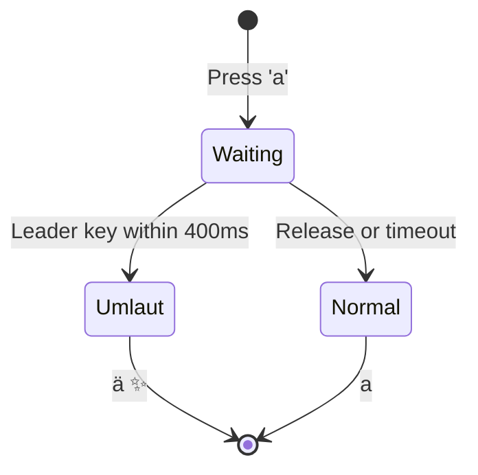
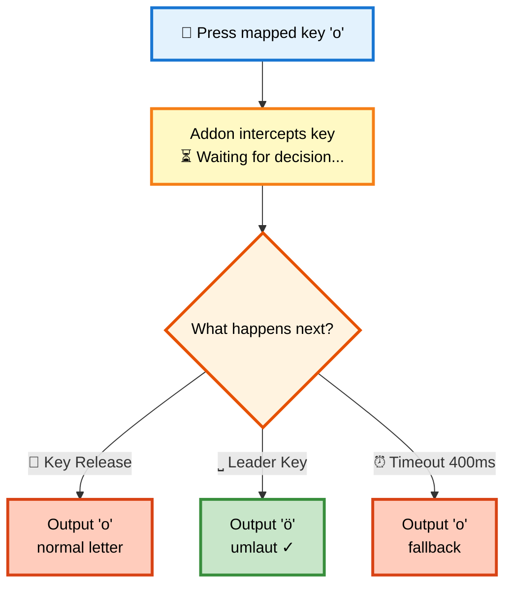
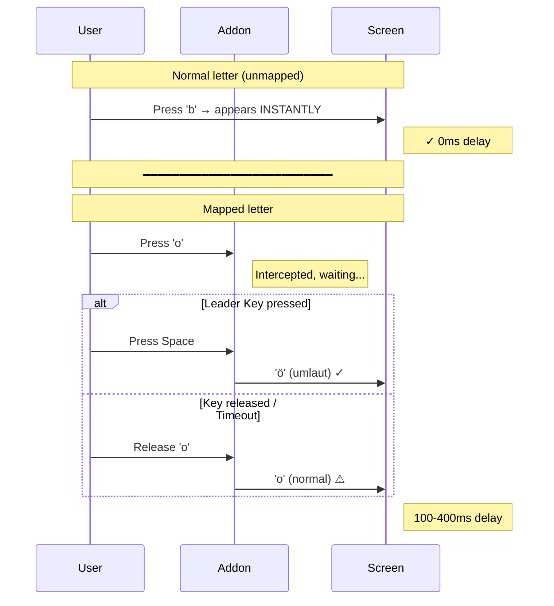
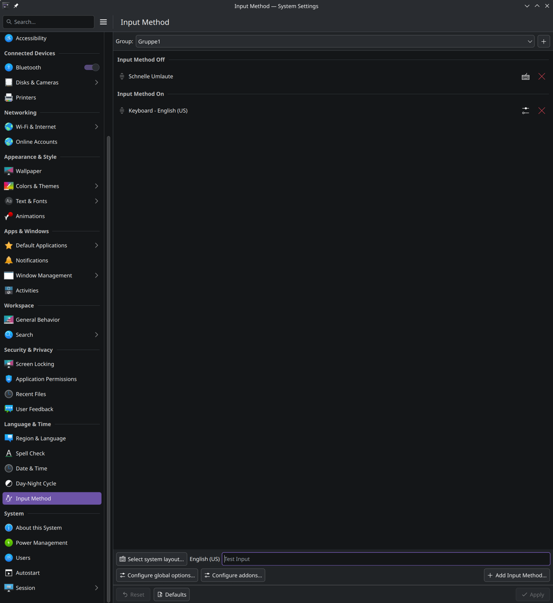
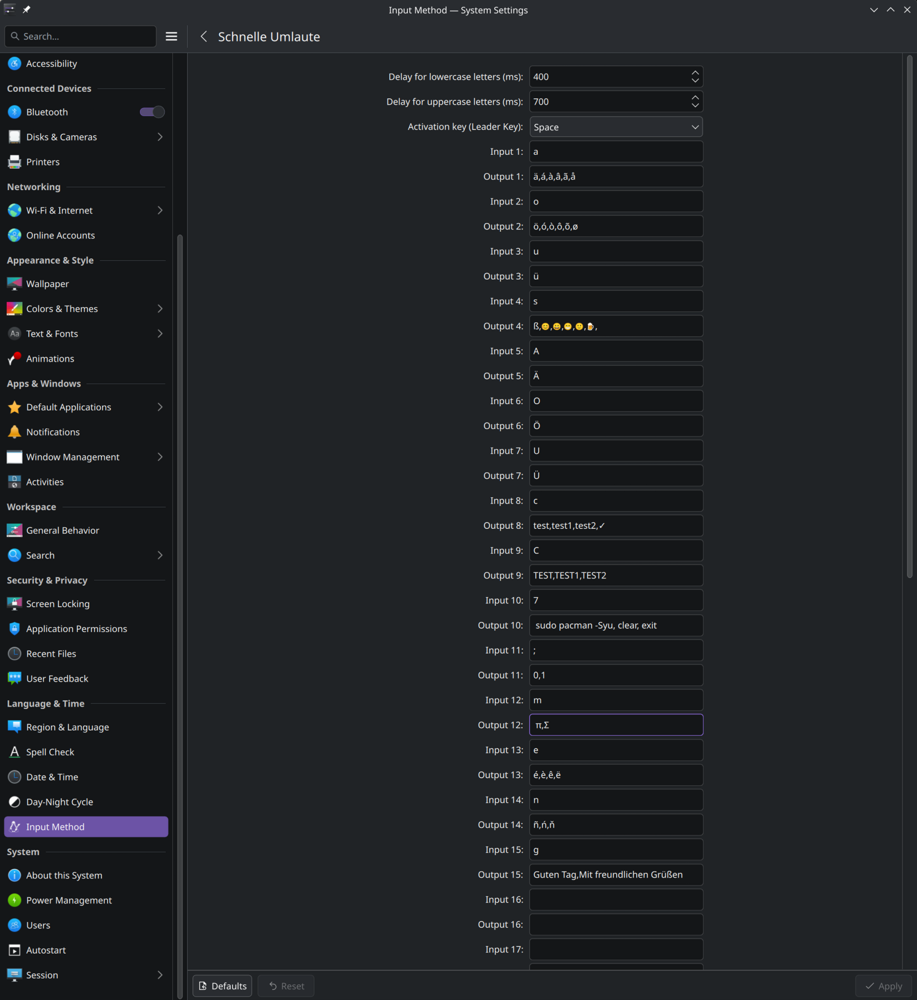
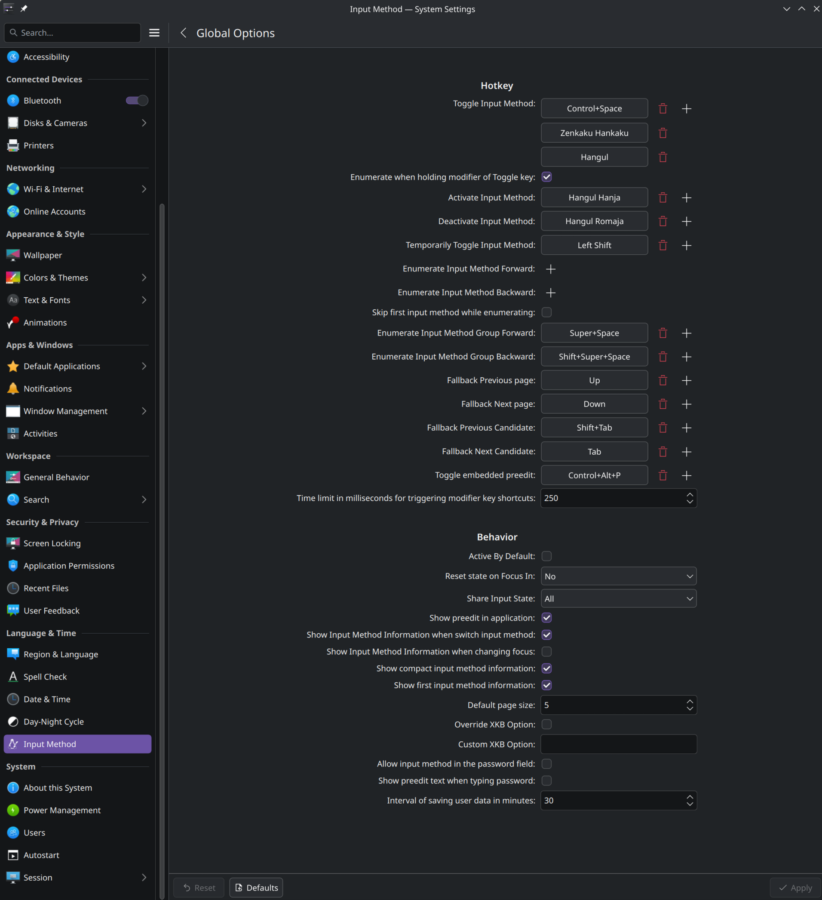
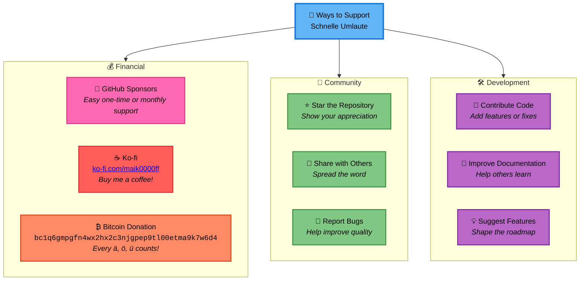

# Schnelle Umlaute | PowerToys Quick Accent Alternative for Linux

<p align="center"></p>

[](https://www.gnu.org/licenses/gpl-3.0)
[](https://www.linux.org/)
[](https://fcitx-im.org/)

> [!WARNING]
> **fcitx5 5.1.18+** introduced a regression ([`c2c757f0e3`](https://github.com/fcitx/fcitx5/commit/c2c757f0e3)) that causes this addon to lose focus and stop producing output when switching between application windows. This is a [known upstream issue](https://github.com/fcitx/fcitx5/issues/1532), not a bug in the addon. **For stable operation, use fcitx5 5.1.17.** On Arch Linux: `sudo pacman -U /var/cache/pacman/pkg/fcitx5-5.1.17-1-x86_64.pkg.tar.zst` and add `IgnorePkg = fcitx5` to `/etc/pacman.conf` to prevent automatic upgrades.

**Linux Alternative to Windows PowerToys Quick Accent** - Fast accent and special character input using hold+space gestures.

Missing **PowerToys Quick Accent** on Linux? This Fcitx5 input method addon lets you type accents, umlauts, emojis, symbols, and text snippets using intuitive hold + space keyboard gestures. Supports accent cycling (é → è → ê → ë) for German, French, Spanish and other languages. Clipboard-free operation on X11 and Wayland.

**Features:**
- Hold letter + space/arrow keys for accent characters
- Accent cycling: Press leader key repeatedly to cycle through variants (á → à → â → ã)
- Snippets: Map single keys to entire text phrases
- Braille Unicode characters (⠁⠃⠉⠙⠑ etc.) support
- Configurable activation keys and 30 mapping slots
- No clipboard interference, no root permissions
- Works system-wide on X11 and Wayland

## 🎯 What Makes This Special?

Unlike clipboard-based or keyboard simulation solutions, this Fcitx5 addon uses **direct text insertion** (`commitString()`):

- **Clipboard stays untouched** - No interference with copy/paste
- **No root permissions required** - Runs as normal user
- **Native X11 and Wayland support** - No compatibility layers
- **Hold & Wait pattern** - Zero latency, no backspace needed
- **Part of Fcitx5** - Not a background daemon

## 🚀 How It Works

### Gesture Flow


```mermaid
stateDiagram-v2
    [*] --> Waiting: Press 'a'
    Waiting --> Umlaut: Leader key within 400ms
    Waiting --> Normal: Release or timeout
    Umlaut --> [*]: ä ✨
    Normal --> [*]: a
```

**Note:** Leader key is <kbd>Space</kbd> by default. You can configure it to <kbd>←</kbd>/<kbd>→</kbd> Arrow or combinations in `fcitx5-config-qt`.

### Why Does Typing Feel Different?

This addon works differently than normal typing. Understanding this helps you adapt faster.

#### Scenario 1: Normal Letter (unmapped, e.g. 'b', 'c', 'd')


```mermaid
graph LR
    N1["🔽 Press 'b'"] -->|instant| N2["'b' on screen ✓"]
    N2 --> N3["🔼 Release 'b'"]
    N3 -.->|no action| N4["Done"]

    style N1 fill:#e3f2fd,stroke:#1976d2,stroke-width:3px,color:#000
    style N2 fill:#c8e6c9,stroke:#388e3c,stroke-width:3px,color:#000
    style N3 fill:#f5f5f5,stroke:#757575,stroke-width:2px,color:#000
    style N4 fill:#f5f5f5,stroke:#757575,stroke-width:2px,color:#000
```

**Timing:** 0ms delay - Output on **Press** ✓

---

#### Scenario 2: Mapped Letter (a, o, u, s) - The Decision Point

The addon intercepts the key and waits to see what happens next:


```mermaid
graph TD
    A1["🔽 Press mapped key 'o'"] --> A2["Addon intercepts key<br/>⏳ Waiting for decision..."]
    A2 --> A3{What happens next?}
    A3 -->|"🔼 Key Release"| A4["Output 'o'<br/>normal letter"]
    A3 -->|"⎵ Leader Key"| A5["Output 'ö'<br/>umlaut ✓"]
    A3 -->|"⏰ Timeout 400ms"| A6["Output 'o'<br/>fallback"]

    style A1 fill:#e3f2fd,stroke:#1976d2,stroke-width:3px,color:#000
    style A2 fill:#fff9c4,stroke:#f57f17,stroke-width:3px,color:#000
    style A3 fill:#fff3e0,stroke:#e65100,stroke-width:3px,color:#000
    style A4 fill:#ffccbc,stroke:#d84315,stroke-width:3px,color:#000
    style A5 fill:#c8e6c9,stroke:#388e3c,stroke-width:3px,color:#000
    style A6 fill:#ffccbc,stroke:#d84315,stroke-width:3px,color:#000
```

**Timing:** 100-400ms delay - Output depends on user action ⚠

---

#### The Critical Difference: Timing Expectation


```mermaid
sequenceDiagram
    participant User
    participant Addon
    participant Screen

    Note over User,Screen: Normal letter (unmapped)
    User->>Screen: Press 'b' → appears INSTANTLY
    Note right of Screen: ✓ 0ms delay

    Note over User,Screen: ━━━━━━━━━━━━━━━━━━━━━━━━━━

    Note over User,Screen: Mapped letter
    User->>Addon: Press 'o'
    Note right of Addon: Intercepted, waiting...
    alt Leader Key pressed
        User->>Addon: Press Space
        Addon->>Screen: 'ö' (umlaut) ✓
    else Key released / Timeout
        User->>Addon: Release 'o'
        Addon->>Screen: 'o' (normal) ⚠
    end
    Note right of Screen: 100-400ms delay
```

#### Quick Comparison

| Action | Normal Letter | Mapped Letter (a,o,u,s) |
|--------|--------------|------------------------|
| **Output Trigger** | Key **Press** | Key **Release** or Leader Key |
| **Timing** | Instant (0ms) | Delayed (100-400ms) |
| **Feel** | Direct feedback | Slight "lag" |

**Why the delay?** The addon must wait after a mapped key press to determine whether the leader key follows (→ accent) or the key is simply released (→ normal letter).

### Supported Characters

**Default mappings (configurable):**

**Lowercase (400ms delay):**

| Hold | + | Press | = | Result |
|------|---|-------|---|--------|
| <kbd>a</kbd> | + | <kbd>Space</kbd> | = | ä |
| <kbd>o</kbd> | + | <kbd>Space</kbd> | = | ö |
| <kbd>u</kbd> | + | <kbd>Space</kbd> | = | ü |
| <kbd>s</kbd> | + | <kbd>Space</kbd> | = | ß |

**Uppercase (700ms delay, longer for coordination):**

| Hold | + | Press | = | Result |
|------|---|-------|---|--------|
| <kbd>Shift</kbd> + <kbd>a</kbd> | + | <kbd>Space</kbd> | = | Ä |
| <kbd>Shift</kbd> + <kbd>o</kbd> | + | <kbd>Space</kbd> | = | Ö |
| <kbd>Shift</kbd> + <kbd>u</kbd> | + | <kbd>Space</kbd> | = | Ü |

**Note:** The uppercase delay is longer because typing <kbd>Shift</kbd> + Letter + <kbd>Space</kbd> requires more finger coordination.

**All character mappings are fully customizable!** You can configure up to 30 custom input→output mappings via `fcitx5-config-qt`. See the "Customizing Character Mappings" section below for details.

## 📋 Requirements

- **Linux** with Fcitx5 support
  - **Arch Linux** - Fully tested and supported
  - **Ubuntu/Debian** - Supported (via `install-ubuntu.sh`)
- **Fcitx5** - Input Method Framework
- **CMake** and **extra-cmake-modules** - For building
- **GCC with C++20 support** - For compilation

## 📦 Installation

### Arch Linux (Recommended)

```bash
git clone https://github.com/Maik-0000FF/schnelle-umlaute.git
cd schnelle-umlaute
./install.sh
```

The script will:
- Check and install dependencies
- Build and install the addon
- Configure environment variables automatically
- Guide you through the setup

**After installation:** Logout and login, then run `fcitx5-config-qt` to add "Schnelle Umlaute" to your input methods.

### Ubuntu / Debian

```bash
git clone https://github.com/Maik-0000FF/schnelle-umlaute.git
cd schnelle-umlaute
./install-ubuntu.sh
```

The script will:
- Install all required packages via `apt`
- Build and install the addon
- Configure Fcitx5 as default input method (replaces IBus)
- Set up environment variables for GNOME
- Configure autostart

**After installation:** Logout and login, then run `fcitx5-config-qt` to add "Schnelle Umlaute" to your input methods.

**Note:** Make sure to uncheck "Only Show Current Language" when searching for the addon.

### 🔧 Manual Installation (Arch Linux)

If you prefer manual installation:

**1. Install Dependencies**

```bash
sudo pacman -S fcitx5 fcitx5-configtool fcitx5-qt fcitx5-gtk cmake extra-cmake-modules gcc
```

**2. Build the Addon**

```bash
cd addon
./build.sh
```

**3. Install**

```bash
cd build
sudo make install
```

**4. Configure Environment Variables**

For the addon to work in ALL applications (GTK, Qt, browsers, terminals, etc.), set up environment variables:

```bash
mkdir -p ~/.config/environment.d
cat > ~/.config/environment.d/fcitx5.conf << 'EOF'
GTK_IM_MODULE=fcitx5
QT_IM_MODULE=fcitx5
XMODIFIERS=@im=fcitx5
GLFW_IM_MODULE=ibus
EOF
```

**Note:** `GLFW_IM_MODULE=ibus` is required for Kitty terminal and other GLFW-based applications.

**5. Logout and Login**

**IMPORTANT:** You must logout and login again for the environment variables to take effect!

```bash
# After logout/login, verify Fcitx5 is running:
fcitx5 -r
```

### 🔧 Manual Installation (Ubuntu / Debian)

If you prefer manual installation:

**1. Install Dependencies**

```bash
sudo apt update
sudo apt install fcitx5 fcitx5-config-qt fcitx5-frontend-gtk3 fcitx5-frontend-gtk4 \
    fcitx5-frontend-qt5 libfcitx5core-dev fcitx5-modules-dev cmake extra-cmake-modules g++ gettext
```

**2. Build the Addon**

```bash
cd addon
./build.sh
```

**3. Install**

```bash
cd build
sudo make install
```

**4. Configure Environment Variables**

For the addon to work in ALL applications (GTK, Qt, browsers, terminals, etc.), set up environment variables:

```bash
mkdir -p ~/.config/environment.d
cat > ~/.config/environment.d/fcitx5.conf << 'EOF'
GTK_IM_MODULE=fcitx
QT_IM_MODULE=fcitx
XMODIFIERS=@im=fcitx
EOF
```

**Note:** On Ubuntu/Debian, use `fcitx` (not `fcitx5`) for the environment variables.

**5. Set Fcitx5 as Default Input Method**

```bash
im-config -n fcitx5
```

**6. Setup Autostart (GNOME only)**

> Skip this step on KDE Wayland — KWin starts Fcitx5 automatically. Adding autostart causes a dual-instance conflict.

```bash
mkdir -p ~/.config/autostart
cp /usr/share/applications/org.fcitx.Fcitx5.desktop ~/.config/autostart/
```

**7. Logout and Login**

**IMPORTANT:** You must logout and login again for the environment variables to take effect!

```bash
# After logout/login, verify Fcitx5 is running:
fcitx5 -r
```

**GNOME Users:** If Fcitx5 doesn't work in GNOME apps, run:
```bash
gsettings set org.gnome.settings-daemon.plugins.xsettings overrides "{'Gtk/IMModule':<'fcitx'>}"
```

## 🎮 Setup & Usage

### Important: Keyboard Layout Requirement

This addon is **not a standalone keyboard layout** - it works **alongside** your existing keyboard layout.

**You always need a base keyboard layout** (e.g., US) in your Fcitx5 configuration. The addon:
- Receives characters that are already translated by your base layout
- Only modifies the configured keys (a, o, u, s, etc.)
- Passes all other keys through unchanged

### Configure Fcitx5

1. Open Fcitx5 configuration:
   ```bash
   fcitx5-config-qt
   ```

2. Go to **"Input Method"** tab

3. Click **"Add Input Method..."** and search for **"Schnelle Umlaute"**

4. Add it to your input methods and click **"Apply"**



### Using the Addon

1. **Switch to Schnelle Umlaute** input method (default: <kbd>Ctrl</kbd> + <kbd>Space</kbd>)
   - When active, the Fcitx5 tray icon will show **"Ää"**
   - When using normal keyboard, it shows "En" or "US"

2. **Type umlauts:** Hold a mapped key, then press the leader key within the time window. See [Supported Characters](#supported-characters) for all default mappings.

3. **Type normally:** If you don't press the leader key within the time window, the normal letter appears

### Configuration (Advanced)

All addon settings can be changed in two ways:

- **Via GUI** (recommended): `fcitx5-config-qt` → select "Schnelle Umlaute" → click **Configure** (wrench icon)
- **Via config file**: edit `~/.config/fcitx5/conf/schnelle-umlaute.conf`

**After config file changes**, restart Fcitx5 with `fcitx5 -r`. GUI changes apply immediately after clicking Apply.



#### Delays

Customize the timing delays to match your typing speed:

| Setting | Default | Description |
|---------|---------|-------------|
| **DelayLowercase** | 400ms | Time window for lowercase gestures |
| **DelayUppercase** | 700ms | Time window for uppercase gestures (longer because <kbd>Shift</kbd> + Letter + <kbd>Space</kbd> requires more coordination) |

Valid range: 50-2000ms, any exact value accepted.

```ini
[DelayLowercase]
Value=400

[DelayUppercase]
Value=700
```

**Tips:**
- Start with defaults and adjust if needed
- Faster typists may prefer shorter delays (300ms/600ms)
- Slower, more deliberate typing benefits from longer delays (500ms/800ms)

#### Leader Key

Customize which key activates the umlaut transformation:

| Option | Keys |
|--------|------|
| **Space** (Default) | <kbd>Space</kbd> |
| LeftArrow | <kbd>←</kbd> |
| RightArrow | <kbd>→</kbd> |
| SpaceOrLeft | <kbd>Space</kbd> or <kbd>←</kbd> |
| SpaceOrRight | <kbd>Space</kbd> or <kbd>→</kbd> |
| LeftOrRight | <kbd>←</kbd> or <kbd>→</kbd> |
| All | <kbd>Space</kbd>, <kbd>←</kbd>, <kbd>→</kbd> |

```ini
# Options: Space, LeftArrow, RightArrow, SpaceOrLeft, SpaceOrRight, LeftOrRight, All
LeaderKey=Space
```

#### Character Mappings

The addon provides **30 mapping slots** that you can configure freely. The first 7 slots are pre-configured with German umlauts (see [Supported Characters](#supported-characters)).

In the GUI, scroll down to see mapping fields (**Input 1** / **Output 1** through **Input 30** / **Output 30**). Empty slots are ignored. Click **"Defaults"** to restore German umlauts.

```ini
# Default German mappings
Mapping1Input=a
Mapping1Output=ä

Mapping2Input=o
Mapping2Output=ö

# Add your own mappings
Mapping8Input=e
Mapping8Output=é

Mapping9Input=n
Mapping9Output=ñ
```

**Quick examples:** French accents (é, è, ê), Spanish (ñ, á), Math symbols (π, ∂), Braille characters (⠁⠃⠉). See sections below for Accent Cycling, Snippets, and Emoji mappings.

### Accent Cycling

Cycle through multiple accent variants by pressing the leader key repeatedly. Instead of creating separate mappings for each variant, define all variants in a single Output field separated by commas.

**How it works:**
1. Hold the input key (e.g., <kbd>e</kbd>)
2. Press leader key (<kbd>Space</kbd>) → first variant appears (e.g., `é`)
3. Press leader key again → next variant (e.g., `è`)
4. Keep pressing → cycles through all variants (è → ê → ë → é → ...)
5. Release input key → cycling stops, current selection is kept

In the GUI, enter comma-separated variants in any Output field (e.g., Output 8: `é,è,ê,ë` for Input 8: `e`).

**Config file example:**

```ini
# ~/.config/fcitx5/conf/schnelle-umlaute.conf

# Single output (no cycling)
Mapping1Input=a
Mapping1Output=ä

# Multiple outputs with cycling
Mapping8Input=e
Mapping8Output=é,è,ê,ë

Mapping9Input=a
Mapping9Output=á,à,â,ã,å

Mapping10Input=c
Mapping10Output=ç,ć,č
```

**Example cycling mappings:**

| Input | Output | Cycling sequence |
|-------|--------|------------------|
| <kbd>e</kbd> | é,è,ê,ë | é → è → ê → ë → é → ... |
| <kbd>a</kbd> | á,à,â,ã,å | á → à → â → ã → å → á → ... |
| <kbd>n</kbd> | ñ,ń,ň | ñ → ń → ň → ñ → ... |
| <kbd>o</kbd> | ó,ò,ô,õ,ø | ó → ò → ô → õ → ø → ó → ... |

### Snippets (Text Expansion)

Map a single key to an entire phrase or longer text. Useful for frequently typed words, signatures, or boilerplate text.

| Input | Output | Use case |
|-------|--------|----------|
| <kbd>g</kbd> | Guten Tag | German greeting |
| <kbd>m</kbd> | Mit freundlichen Grüßen | Email signature |
| <kbd>@</kbd> | name@example.com | Email address |
| <kbd>t</kbd> | TODO: | Code annotation |

```ini
Mapping11Input=g
Mapping11Output=Guten Tag

Mapping12Input=m
Mapping12Output=Mit freundlichen Grüßen

Mapping13Input=@
Mapping13Output=name@example.com
```

Hold <kbd>g</kbd> + press <kbd>Space</kbd> → "Guten Tag" is inserted.

**Important:** Snippets cannot contain commas, as commas are used as the separator for cycling. Use snippets only for text without commas.

### Emoji Mappings

Map keys to emoji for quick insertion without opening an emoji picker.

**Examples:**

| Input | Output | Description |
|-------|--------|-------------|
| <kbd>h</kbd> | ❤️ | Heart |
| <kbd>t</kbd> | 👍 | Thumbs up |
| <kbd>s</kbd> | 😊 | Smile |
| <kbd>c</kbd> | ✓ | Checkmark |

Emoji cycling also works: `Mapping14Output=😊,😀,😁,🙂` cycles through smileys.

## 🏗️ Architecture

This is a **native Fcitx5 addon** written in **C++**, using the Fcitx5 InputMethodEngineV2 API.

**Key Components:**
- `addon/src/schnelle-umlaute.cpp` - Main addon logic with Hold & Wait implementation
- `addon/CMakeLists.txt` - Build configuration
- `addon/data/schnelle-umlaute.conf` - Fcitx5 addon registration

**How it works internally:**
1. Fcitx5 calls our `keyEvent()` handler for every key
2. When accent key (a/o/u/s) is pressed: suppress output, start timer
3. If Space within delay (400ms lowercase, 700ms uppercase): call `commitString(umlaut)` for direct insertion
4. If timeout or key released: call `commitString(normalLetter)`
5. No clipboard, no key simulation - pure text insertion!

## 🆚 Comparison with Other Approaches

| Approach | Clipboard-Free | No Root | X11 | Wayland | Complexity |
|----------|---------------|---------|-----|---------|------------|
| **Fcitx5 Addon (This)** | ✅ | ✅ | ✅ | ✅ | Medium |
| evdev-rs + xclip | ❌ | ❌ | ✅ | ⚠️ | Low |
| IBus | ✅ | ✅ | ✅ | ✅ | High |
| XTest | ✅ | ❌ | ✅ | ❌ | Low |

## 🐛 Troubleshooting

### fcitx5 5.1.18+ focus regression — addon stops working after window switch

**Symptom:** After switching between application windows (alt-tab), the addon stops producing output. Mapped keys are consumed but nothing appears on screen. Double overlay icons may appear in the system tray.

**Cause:** Commit [`c2c757f0e3`](https://github.com/fcitx/fcitx5/commit/c2c757f0e3) in fcitx5 5.1.18 changed the Wayland input method frontend to call `focusInWrapper()` unconditionally on every key event. Previously, this was guarded by `if (!realFocus())`. The unconditional call creates race conditions during the compositor's activate/deactivate cycle when switching windows, causing the addon's `commitString()` to go to a stale input context.

This is an [upstream issue](https://github.com/fcitx/fcitx5/issues/1532) — not a bug in the addon.

**Fix — downgrade to fcitx5 5.1.17:**

```bash
# Arch Linux: downgrade from pacman cache
sudo pacman -U /var/cache/pacman/pkg/fcitx5-5.1.17-1-x86_64.pkg.tar.zst

# Prevent automatic upgrade
sudo sed -i '/^#IgnorePkg/a IgnorePkg = fcitx5' /etc/pacman.conf
```

**Temporary workaround (if downgrade is not possible):**

If the addon stops working after a window switch, open `fcitx5-config-qt`, remove "Schnelle Umlaute" from your input methods, click Apply, then add it back and click Apply again. This forces fcitx5 to re-initialize the input method connection.

### Addon not showing in fcitx5-config-qt

Check if all files are installed:
```bash
ls /usr/lib/fcitx5/schnelle-umlaute.so
ls /usr/share/fcitx5/addon/schnelle-umlaute.conf
ls /usr/share/fcitx5/addon/schnelle-umlaute.conf.in  # For GUI config options
ls /usr/share/fcitx5/inputmethod/schnelle-umlaute.conf  # This is important!
```

If missing, reinstall:
```bash
cd addon/build
sudo make install
fcitx5 -r
```

### Configuration options not visible in GUI

If the addon appears but you can't see DelayLowercase/DelayUppercase settings:

1. Check if the config descriptor is installed:
   ```bash
   ls /usr/share/fcitx5/addon/schnelle-umlaute.conf.in
   ```

2. If missing, reinstall the addon:
   ```bash
   cd addon && ./build.sh && cd build && sudo make install && fcitx5 -r
   ```

### Works in terminal but not in other apps (Firefox, Kate, etc.)

Environment variables must be set correctly. See the environment variables step in [Manual Installation (Arch)](#-manual-installation-arch-linux) or [Manual Installation (Ubuntu)](#-manual-installation-ubuntu--debian) for your platform.

Then **logout and login again** for changes to take effect.

### Umlauts not appearing

1. Make sure you're switched to "Schnelle Umlaute" input method (<kbd>Ctrl</kbd> + <kbd>Space</kbd>)
2. Check Fcitx5 is running: `ps aux | grep fcitx5`
3. Try holding the key longer before pressing Space
4. Verify environment variables are set: `echo $GTK_IM_MODULE` (should output "fcitx5")

### Addon is visible but not activatable / Fcitx5 not responding

If you can see "Schnelle Umlaute" in fcitx5-config-qt but cannot activate it, or if Fcitx5 stopped working after a system crash:

1. **Check Fcitx5 status:**
   ```bash
   fcitx5-remote
   ```
   - Should show: `1` (inactive) or `2` (active)
   - If it shows: `0` → Fcitx5 not initialized

2. **Restart Fcitx5:**
   ```bash
   fcitx5 -r
   ```

3. **Activate addon:**
   ```bash
   fcitx5-remote -s schnelle-umlaute
   ```

4. **Verify:**
   ```bash
   fcitx5-remote -n  # Should show: schnelle-umlaute
   fcitx5-remote     # Should show: 2 (active)
   ```

This is common after system crashes or unexpected shutdowns.

### KDE Wayland users: "Fcitx should be launched by KWin" warning

If you see a warning about Fcitx5 not being launched by KWin, fix it for optimal Wayland experience:

1. Open **System Settings** → **Virtual Keyboard** (or search for "virtuell")
2. Select **"Fcitx 5"** from the dropdown (instead of "None")
3. Apply changes
4. **Restart your session** (logout/login)

This enables the native Wayland input method protocol and eliminates the warning.

### Input method not shared across applications

By default, Fcitx5 remembers the input method **per application**. If you switch to "Schnelle Umlaute" in Firefox, the terminal may still use the US keyboard.

To share the input method state globally:

1. Open Fcitx5 configuration: `fcitx5-config-qt`
2. Go to **Global Options**
3. Set **Share Input State** to **All**
4. Restart Fcitx5: `fcitx5 -r`

### WezTerm known issues

WezTerm has upstream issues with fcitx5 that are **not caused by this addon**:

- **Addon not working after fcitx5 restart:** WezTerm cannot reconnect to fcitx5 via XIM. Re-login or restart WezTerm after addon changes. ([#2819](https://github.com/wezterm/wezterm/issues/2819))
- **Key repeat flood after fcitx5 restart:** If fcitx5 is killed (e.g. via `killall`) while a mapped key is being processed, WezTerm may lose the key release event. This causes the last key to repeat endlessly. Re-login to fix. ([#2819](https://github.com/wezterm/wezterm/issues/2819))
- **Copy/paste between WezTerm windows:** May require clicking into the target window first on Wayland. ([#6685](https://github.com/wezterm/wezterm/issues/6685))

These issues do not occur in Kitty, which uses a more robust IME integration.

### XWayland mixed mode: addon stops working globally

**Symptom:** After opening an X11 application from a Wayland session (e.g. via `--ozone-platform=x11` or native X11 apps like `xterm`), the addon stops working — not only in the X11 app, but in **all** applications. Mapped keys are swallowed with no output. The addon does not recover after closing the X11 app.

**Affected applications:**
| Application | Status after XWayland app opened |
|---|---|
| WezTerm | Broken |
| Chromium | Broken |
| Neovide | Broken |
| Ghostty | Not affected |
| Firefox | Not affected |

**Cause:** XWayland sends focus events that are incompatible with fcitx5's Wayland input method protocol. This corrupts the input method connection for applications with fragile IM bindings (winit-based apps via XIM, Chromium's custom input stack). Applications with robust IM implementations (Ghostty, Firefox) are not affected.

**Recovery:** Restarting fcitx5 alone does not fix the affected apps. A re-login is not always sufficient either. A full system reboot reliably restores functionality.

**Note:** This is not a bug in the addon — it is caused by the interaction between XWayland focus handling and the affected applications' input method implementations. In a pure X11 or pure Wayland session, this does not occur.

### Build errors

Make sure you have C++20 support:
```bash
gcc --version  # Should be 11 or newer
```

### Cycling preview not visible

**Symptom:** When cycling through accent variants, you don't see the current character changing. The cycling works, but the preview is not displayed.

**Cause 1 - "Show Preedit In Application" disabled:** The addon uses Fcitx5's client preedit to display the cycling preview. If **"Show Preedit In Application"** is disabled in Fcitx5's global options, the preview cannot be forwarded to the application.

**Fix:** Open `fcitx5-config-qt` → **Global Options** → enable **"Show Preedit In Application"**.



**Cause 2 - Terminal emulators:** Many terminal emulators don't display preedit (composition) text visually, even when the setting is enabled. The cycling still works internally.

**Workaround for terminals:** Count your <kbd>Space</kbd> presses to reach the desired variant:
- 1× <kbd>Space</kbd> = first variant (e.g., ä)
- 2× <kbd>Space</kbd> = second variant (e.g., à)
- 3× <kbd>Space</kbd> = third variant (e.g., â)

The final character is committed when you release the input key. In GUI applications (Firefox, Kate, etc.), the cycling preview is displayed in real-time.

### Double characters in security-sensitive input fields (banking, login, etc.)

**Symptom:** When typing a mapped character (e.g., `1` mapped on Input 10) in a security-sensitive input field (banking forms, login pages, 2FA codes), the character appears twice (e.g., `11` instead of `1`).

**Cause:** This is **not a bug in the addon**. Security-sensitive input fields often disable or partially implement the input method (IME) protocol. The addon's normal flow is:

1. Key press → `filterAndAccept()` consumes the key (original character suppressed)
2. Key release or timeout → `commitString()` sends the character once

When a security field ignores `filterAndAccept()`, both the raw keystroke **and** the committed string reach the field, resulting in a double character.

**Affected:** Any mapped character - letters, digits, and special characters alike. It is more noticeable with digits (e.g., year input `2024` becomes `20024`) because digits are commonly used in security forms.

**Workaround:**
- Switch to your base keyboard layout (<kbd>Ctrl</kbd> + <kbd>Space</kbd>) before entering data in security-sensitive fields
- Avoid mapping characters that are frequently needed in security contexts (digits, common password characters)

### General compatibility note

Not all applications fully support Fcitx5's input method protocol. The addon relies on the application correctly handling:
- Preedit (composition) text display
- Commit string insertion
- Input context state management

Applications with custom text rendering or non-standard input handling may not work correctly. If you encounter issues in a specific application, please report it on the GitHub issues page.

## 🗑️ Uninstallation

### Arch Linux

```bash
./uninstall.sh
```

### Ubuntu / Debian

```bash
./uninstall-ubuntu.sh
```

Both scripts will:
- Remove all installed addon files
- Ask if you want to remove environment/autostart configuration
- Restart Fcitx5

### Manual Uninstallation

```bash
cd addon/build
sudo make uninstall
fcitx5 -r
```

Or remove files manually:
```bash
sudo rm /usr/lib/fcitx5/schnelle-umlaute.so
sudo rm /usr/share/fcitx5/addon/schnelle-umlaute.conf
sudo rm /usr/share/fcitx5/addon/schnelle-umlaute.conf.in
sudo rm /usr/share/fcitx5/addon/org.fcitx.Fcitx5.Addon.SchnelleUmlaute.metainfo.xml
sudo rm /usr/share/fcitx5/inputmethod/schnelle-umlaute.conf
rm ~/.config/environment.d/fcitx5.conf  # Optional: remove environment config
fcitx5 -r
```

## 🤝 Contributing

Contributions welcome! This addon is:
- Written in **C++20**
- Uses **Fcitx5 InputMethodEngineV2 API**
- Built with **CMake**

## 🍺 Support

Help keep Schnelle Umlaute awesome! Here's how you can contribute:

[](https://github.com/sponsors/Maik-0000FF)
[](https://ko-fi.com/maik0000ff)


```mermaid
graph TB
    Start["🍺 Ways to Support<br/>Schnelle Umlaute"]

    subgraph one["💰 Financial"]
        Sponsor["💖 GitHub Sponsors<br/><i>Easy one-time or monthly support</i>"]
        Kofi["☕ Ko-fi<br/><a href='https://ko-fi.com/maik0000ff'>ko-fi.com/maik0000ff</a><br/><i>Buy me a coffee!</i>"]
        Bitcoin["₿ Bitcoin Donation<br/><code>bc1q6gmpgfn4wx2hx2c3njgpep9tl00etma9k7w6d4</code><br/><i>Every ä, ö, ü counts!</i>"]
    end

    subgraph two["🌟 Community"]
        Star["⭐ Star the Repository<br/><i>Show your appreciation</i>"]
        Share["📢 Share with Others<br/><i>Spread the word</i>"]
        Report["🐛 Report Bugs<br/><i>Help improve quality</i>"]
    end

    subgraph three["🛠️ Development"]
        Code["🔧 Contribute Code<br/><i>Add features or fixes</i>"]
        Docs["📝 Improve Documentation<br/><i>Help others learn</i>"]
        Ideas["💡 Suggest Features<br/><i>Shape the roadmap</i>"]
    end

    Start --> one
    Start --> two
    Start --> three

    style Start fill:#64b5f6,stroke:#1976d2,stroke-width:3px,color:#000
    style Sponsor fill:#ff69b4,stroke:#d63384,stroke-width:2px,color:#000
    style Kofi fill:#ff5e5b,stroke:#d32f2f,stroke-width:2px,color:#000
    style Bitcoin fill:#ff8a65,stroke:#d84315,stroke-width:2px,color:#000
    style Star fill:#81c784,stroke:#388e3c,stroke-width:2px,color:#000
    style Share fill:#81c784,stroke:#388e3c,stroke-width:2px,color:#000
    style Report fill:#81c784,stroke:#388e3c,stroke-width:2px,color:#000
    style Code fill:#ba68c8,stroke:#7b1fa2,stroke-width:2px,color:#000
    style Docs fill:#ba68c8,stroke:#7b1fa2,stroke-width:2px,color:#000
    style Ideas fill:#ba68c8,stroke:#7b1fa2,stroke-width:2px,color:#000
```

_Because every umlaut saved is a keystroke earned - and keystrokes fuel open source!_ ⌨️✨

## 📄 License

GPL-3.0+

## 👨‍💻 Author

Created by [Maik-0000FF](https://github.com/Maik-0000FF)

## 🙏 Credits

Inspired by [Windows PowerToys Quick Accent](https://learn.microsoft.com/en-us/windows/powertoys/quick-accent)

Built with:
- **Fcitx5** - Input Method Framework
- **C++20** - Modern C++ with chrono and optional
- **CMake** - Build system
- **Extra CMake Modules (ECM)** - KDE build tools

---

**Version:** 0.1.4
**Status:** Working - tested and functional
**Date:** 2026-03-19
