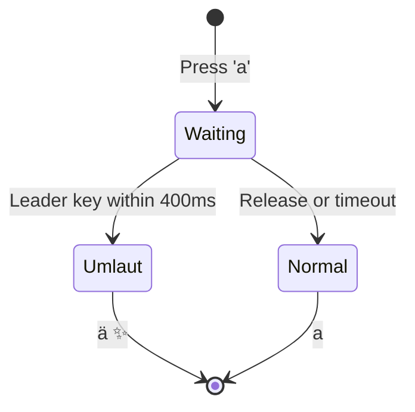
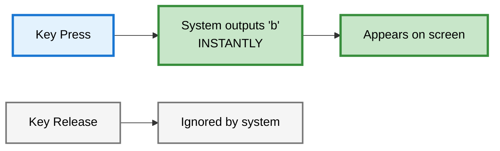
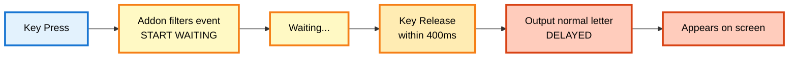
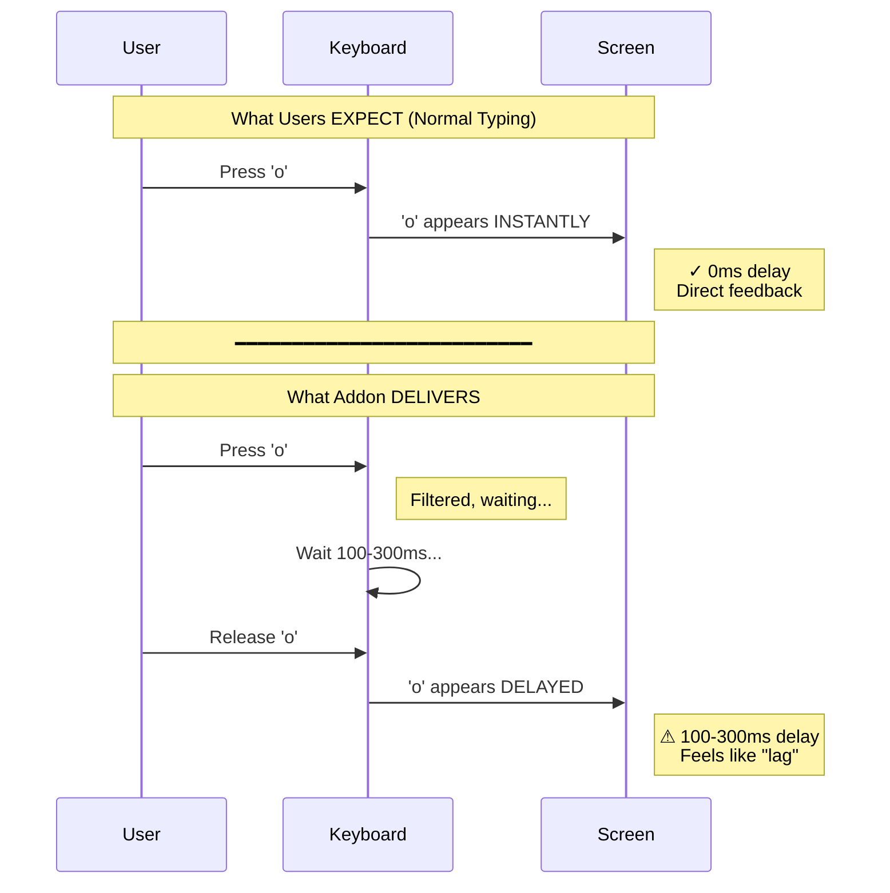
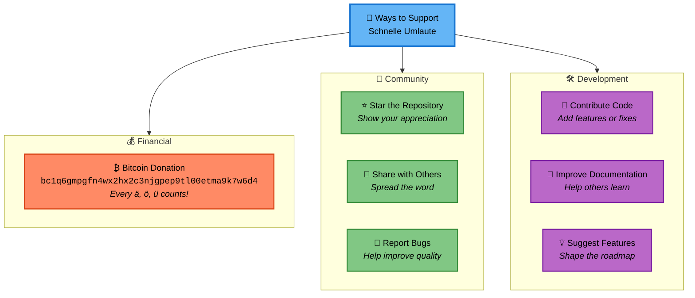

# Schnelle Umlaute | PowerToys Quick Accent Alternative for Linux

[](https://www.gnu.org/licenses/gpl-3.0)
[](https://www.linux.org/)
[](https://fcitx-im.org/)

**Linux Alternative to Windows PowerToys Quick Accent** - Fast accent input using hold+space gestures.

Missing **PowerToys Quick Accent** on Linux? This is the solution. Type accents, umlauts, emojis, symbols, and text snippets using intuitive hold + space gestures. Supports accent cycling through multiple variants. Native Fcitx5 addon with clipboard-free operation for X11 and Wayland.

**Features:**
- Hold letter + space/arrow keys for accent characters
- Accent cycling: Press leader key repeatedly to cycle through variants (á → à → â → ã)
- Snippets: Map single keys to entire text phrases
- Configurable activation keys and 20 mapping slots
- No clipboard interference, no root permissions
- Works system-wide on X11 and Wayland

## 🎯 What Makes This Special?

Unlike clipboard-based or keyboard simulation solutions, this Fcitx5 addon uses **direct text insertion** (`commitString()`):

- **Clipboard stays untouched** - No interference with copy/paste
- **No root permissions required** - Runs as normal user
- **Native X11 and Wayland support** - No compatibility layers
- **Hold & Wait pattern** - Zero latency, no backspace needed
- **Part of Fcitx5** - Not a background daemon

## 🚀 How It Works

### Gesture Flow


```mermaid
stateDiagram-v2
    [*] --> Waiting: Press 'a'
    Waiting --> Umlaut: Leader key within 400ms
    Waiting --> Normal: Release or timeout
    Umlaut --> [*]: ä ✨
    Normal --> [*]: a
```

**Note:** Leader key is <kbd>Space</kbd> by default. You can configure it to <kbd>←</kbd>/<kbd>→</kbd> Arrow or combinations in `fcitx5-config-qt`.

### Why Does Typing Feel Different?

This addon works differently than normal typing. Understanding this helps you adapt faster.

#### Scenario 1: Normal Letter (e.g. 'b', 'c', 'd')


```mermaid
graph LR
    N1[Key Press] --> N2[System outputs 'b'<br/>INSTANTLY]
    N2 --> N3[Appears on screen]
    N4[Key Release] --> N5[Ignored by system]

    style N1 fill:#e3f2fd,stroke:#1976d2,stroke-width:3px,color:#000
    style N2 fill:#c8e6c9,stroke:#388e3c,stroke-width:3px,color:#000
    style N3 fill:#c8e6c9,stroke:#388e3c,stroke-width:3px,color:#000
    style N4 fill:#f5f5f5,stroke:#757575,stroke-width:2px,color:#000
    style N5 fill:#f5f5f5,stroke:#757575,stroke-width:2px,color:#000
```

**Timing:** 0ms delay - Output on **Press** ✓

---

#### Scenario 2: Addon Letter (a, o, u, s) - Quick Release


```mermaid
graph LR
    A1[Key Press] --> A2[Addon filters event<br/>START WAITING]
    A2 --> A3[Waiting...]
    A3 --> A4[Key Release<br/>within 400ms]
    A4 --> A5[Output normal letter<br/>DELAYED]
    A5 --> A6[Appears on screen]

    style A1 fill:#e3f2fd,stroke:#1976d2,stroke-width:3px,color:#000
    style A2 fill:#fff9c4,stroke:#f57f17,stroke-width:3px,color:#000
    style A3 fill:#fff9c4,stroke:#f57f17,stroke-width:3px,color:#000
    style A4 fill:#ffecb3,stroke:#f57f17,stroke-width:3px,color:#000
    style A5 fill:#ffccbc,stroke:#d84315,stroke-width:3px,color:#000
    style A6 fill:#ffccbc,stroke:#d84315,stroke-width:3px,color:#000
```

**Timing:** 100-300ms delay - Output on **Release** ⚠

---

#### Scenario 3: Addon Letter - With Leader Key (Umlaut)


```mermaid
graph LR
    S1[Key Press] --> S2[Addon filters event<br/>START WAITING]
    S2 --> S3[Waiting...]
    S3 --> S4[Leader Key Press<br/>within 400ms]
    S4 --> S5[Output umlaut 'ö'<br/>SUCCESS]
    S5 --> S6[Appears on screen]

    style S1 fill:#e3f2fd,stroke:#1976d2,stroke-width:3px,color:#000
    style S2 fill:#fff9c4,stroke:#f57f17,stroke-width:3px,color:#000
    style S3 fill:#fff9c4,stroke:#f57f17,stroke-width:3px,color:#000
    style S4 fill:#e1f5fe,stroke:#0288d1,stroke-width:3px,color:#000
    style S5 fill:#c8e6c9,stroke:#388e3c,stroke-width:3px,color:#000
    style S6 fill:#c8e6c9,stroke:#388e3c,stroke-width:3px,color:#000
```

**Timing:** 100-400ms delay - Output on **Leader Key** ✓

---

#### The Critical Difference: Timing Expectation


```mermaid
sequenceDiagram
    participant User
    participant Keyboard
    participant Screen

    Note over User,Screen: What Users EXPECT (Normal Typing)
    User->>Keyboard: Press 'o'
    Keyboard->>Screen: 'o' appears INSTANTLY
    Note right of Screen: ✓ 0ms delay<br/>Direct feedback

    Note over User,Screen: ━━━━━━━━━━━━━━━━━━━━━━━━━━

    Note over User,Screen: What Addon DELIVERS
    User->>Keyboard: Press 'o'
    Note right of Keyboard: Filtered, waiting...
    Keyboard->>Keyboard: Wait 100-300ms...
    User->>Keyboard: Release 'o'
    Keyboard->>Screen: 'o' appears DELAYED
    Note right of Screen: ⚠ 100-300ms delay<br/>Feels like "lag"
```

#### Quick Comparison

| Action | Normal Letter | Addon Letter (a,o,u,s) |
|--------|--------------|------------------------|
| **Output Trigger** | Key **Press** | Key **Release** or Space |
| **Timing** | Instant (0ms) | Delayed (100-400ms) |
| **Feel** | Direct feedback | Slight "lag" |
| **Muscle Memory** | Confirmed ✓ | Takes adjustment ⚠ |

**Why is it different?**
- **Normal typing:** Press = Output (rising edge)
- **With addon:** Press is filtered, we must wait for **decision**
  - Release → normal letter
  - Space → umlaut
  - Timeout → normal letter

### Supported Characters

**Default mappings (configurable):**

**Lowercase (400ms delay):**

| Hold | + | Press | = | Result |
|------|---|-------|---|--------|
| <kbd>a</kbd> | + | <kbd>Space</kbd> | = | ä |
| <kbd>o</kbd> | + | <kbd>Space</kbd> | = | ö |
| <kbd>u</kbd> | + | <kbd>Space</kbd> | = | ü |
| <kbd>s</kbd> | + | <kbd>Space</kbd> | = | ß |

**Uppercase (700ms delay, longer for coordination):**

| Hold | + | Press | = | Result |
|------|---|-------|---|--------|
| <kbd>Shift</kbd> + <kbd>a</kbd> | + | <kbd>Space</kbd> | = | Ä |
| <kbd>Shift</kbd> + <kbd>o</kbd> | + | <kbd>Space</kbd> | = | Ö |
| <kbd>Shift</kbd> + <kbd>u</kbd> | + | <kbd>Space</kbd> | = | Ü |

**Note:** The uppercase delay is longer because typing <kbd>Shift</kbd> + Letter + <kbd>Space</kbd> requires more finger coordination.

**All character mappings are fully customizable!** You can configure up to 20 custom input→output mappings via `fcitx5-config-qt`. See the "Customizing Character Mappings" section below for details.

## 📋 Requirements

- **Linux** with Fcitx5 support
  - **Arch Linux** - Fully tested and supported
  - **Ubuntu/Debian** - Supported (via `install-ubuntu.sh`)
- **Fcitx5** - Input Method Framework
- **CMake** and **extra-cmake-modules** - For building
- **GCC with C++20 support** - For compilation

## 📦 Installation

### Arch Linux (Recommended)

```bash
git clone https://github.com/Maik-0000FF/schnelle-umlaute.git
cd schnelle-umlaute
./install.sh
```

The script will:
- Check and install dependencies
- Build and install the addon
- Configure environment variables automatically
- Guide you through the setup

**After installation:** Logout and login, then run `fcitx5-config-qt` to add "Schnelle Umlaute" to your input methods.

### Ubuntu / Debian

```bash
git clone https://github.com/Maik-0000FF/schnelle-umlaute.git
cd schnelle-umlaute
./install-ubuntu.sh
```

The script will:
- Install all required packages via `apt`
- Build and install the addon
- Configure Fcitx5 as default input method (replaces IBus)
- Set up environment variables for GNOME
- Configure autostart

**After installation:** Logout and login, then run `fcitx5-config-qt` to add "Schnelle Umlaute" to your input methods.

**Note:** Make sure to uncheck "Only Show Current Language" when searching for the addon.

### 🔧 Manual Installation (Arch Linux)

If you prefer manual installation:

**1. Install Dependencies**

```bash
sudo pacman -S fcitx5 fcitx5-configtool fcitx5-qt fcitx5-gtk cmake extra-cmake-modules gcc
```

**2. Build the Addon**

```bash
cd addon
./build.sh
```

**3. Install**

```bash
cd build
sudo make install
```

**4. Configure Environment Variables**

For the addon to work in ALL applications (GTK, Qt, browsers, terminals, etc.), set up environment variables:

```bash
mkdir -p ~/.config/environment.d
cat > ~/.config/environment.d/fcitx5.conf << 'EOF'
GTK_IM_MODULE=fcitx5
QT_IM_MODULE=fcitx5
XMODIFIERS=@im=fcitx5
GLFW_IM_MODULE=ibus
EOF
```

**Note:** `GLFW_IM_MODULE=ibus` is required for Kitty terminal and other GLFW-based applications.

**5. Logout and Login**

**IMPORTANT:** You must logout and login again for the environment variables to take effect!

```bash
# After logout/login, verify Fcitx5 is running:
fcitx5 -r
```

### 🔧 Manual Installation (Ubuntu / Debian)

If you prefer manual installation:

**1. Install Dependencies**

```bash
sudo apt update
sudo apt install fcitx5 fcitx5-config-qt fcitx5-frontend-gtk3 fcitx5-frontend-gtk4 \
    fcitx5-frontend-qt5 libfcitx5core-dev cmake extra-cmake-modules g++ gettext
```

**2. Build the Addon**

```bash
cd addon
./build.sh
```

**3. Install**

```bash
cd build
sudo make install
```

**4. Configure Environment Variables**

For the addon to work in ALL applications (GTK, Qt, browsers, terminals, etc.), set up environment variables:

```bash
mkdir -p ~/.config/environment.d
cat > ~/.config/environment.d/fcitx5.conf << 'EOF'
GTK_IM_MODULE=fcitx
QT_IM_MODULE=fcitx
XMODIFIERS=@im=fcitx
EOF
```

**Note:** On Ubuntu/Debian, use `fcitx` (not `fcitx5`) for the environment variables.

**5. Set Fcitx5 as Default Input Method**

```bash
im-config -n fcitx5
```

**6. Setup Autostart**

```bash
mkdir -p ~/.config/autostart
cp /usr/share/applications/org.fcitx.Fcitx5.desktop ~/.config/autostart/
```

**7. Logout and Login**

**IMPORTANT:** You must logout and login again for the environment variables to take effect!

```bash
# After logout/login, verify Fcitx5 is running:
fcitx5 -r
```

**GNOME Users:** If Fcitx5 doesn't work in GNOME apps, run:
```bash
gsettings set org.gnome.settings-daemon.plugins.xsettings overrides "{'Gtk/IMModule':<'fcitx'>}"
```

## 🎮 Setup & Usage

### Important: Keyboard Layout Requirement

This addon is **not a standalone keyboard layout** - it works **alongside** your existing keyboard layout.

**You always need a base keyboard layout** (e.g., US) in your Fcitx5 configuration. The addon:
- Receives characters that are already translated by your base layout
- Only modifies the configured keys (a, o, u, s, etc.)
- Passes all other keys through unchanged

### Configure Fcitx5

1. Open Fcitx5 configuration:
   ```bash
   fcitx5-config-qt
   ```

2. Go to **"Input Method"** tab (Eingabemethode)

3. Click **"+"** to add a new input method

4. Search for **"Schnelle Umlaute"**

5. Add it to your input methods

6. Click **"Apply"** or **"OK"**

### Using the Addon

1. **Switch to Schnelle Umlaute** input method (default: <kbd>Ctrl</kbd> + <kbd>Space</kbd>)
   - When active, the Fcitx5 tray icon will show **"Ää"**
   - When using normal keyboard, it shows "En" or "US"

2. **Type umlauts:**

| Want | Hold | Press Leader Key | Result |
|------|------|------------------|--------|
| ä | <kbd>a</kbd> | <kbd>Space</kbd> | ä |
| ö | <kbd>o</kbd> | <kbd>Space</kbd> | ö |
| ü | <kbd>u</kbd> | <kbd>Space</kbd> | ü |
| ß | <kbd>s</kbd> | <kbd>Space</kbd> | ß |
| Ä | <kbd>Shift</kbd> + <kbd>a</kbd> | <kbd>Space</kbd> | Ä |
| Ö | <kbd>Shift</kbd> + <kbd>o</kbd> | <kbd>Space</kbd> | Ö |
| Ü | <kbd>Shift</kbd> + <kbd>u</kbd> | <kbd>Space</kbd> | Ü |

   **Note:** Leader key is <kbd>Space</kbd> by default, but can be configured to <kbd>←</kbd>/<kbd>→</kbd> Arrow or combinations (see below).

3. **Type normally:** If you don't press the leader key within the time window, the normal letter appears

### Configuring Delays (Advanced)

You can customize the timing delays to match your typing speed:

1. **Via GUI** (recommended):
   ```bash
   fcitx5-config-qt
   ```
   - Select "Schnelle Umlaute" in the Input Method list
   - Click the **Configure** button (wrench icon)
   - Adjust **DelayLowercase** (default: 400ms) and **DelayUppercase** (default: 700ms)
   - Valid range: 50-2000ms
   - Enter any exact value - no rounding applied

2. **Via config file** (alternative):
   ```bash
   nano ~/.config/fcitx5/conf/schnelle-umlaute.conf
   ```
   ```ini
   [DelayLowercase]
   # Range: 50-2000ms, any exact value accepted
   Value=400

   [DelayUppercase]
   # Range: 50-2000ms, any exact value accepted
   Value=700
   ```

3. **Restart Fcitx5** to apply changes:
   ```bash
   fcitx5 -r
   ```

**Tips:**
- Start with defaults (400ms/700ms) and adjust if needed
- Faster typists may prefer shorter delays (300ms/600ms)
- Slower, more deliberate typing benefits from longer delays (500ms/800ms)
- Uppercase delay should be ~300ms longer than lowercase (harder to coordinate <kbd>Shift</kbd> + Letter + <kbd>Space</kbd>)

### Configuring Leader Key (Advanced)

You can customize which key activates the umlaut transformation. This feature is inspired by PowerToys Quick Accents on Windows.

**Available Options:**
- <kbd>Space</kbd> (Default) - Simple and intuitive
- <kbd>←</kbd> LeftArrow - Cursor moves back, convenient for continued typing
- <kbd>→</kbd> RightArrow - Cursor moves forward
- <kbd>Space</kbd> or <kbd>←</kbd> - Either Space or Left Arrow works
- <kbd>Space</kbd> or <kbd>→</kbd> - Either Space or Right Arrow works
- <kbd>←</kbd> or <kbd>→</kbd> - Either Left or Right Arrow works
- **All** - All three keys work (<kbd>Space</kbd>, <kbd>←</kbd>, <kbd>→</kbd>)

**How to configure:**

1. **Via GUI** (recommended):
   ```bash
   fcitx5-config-qt
   ```
   - Select "Schnelle Umlaute" in the Input Method list
   - Click the **Configure** button (wrench icon)
   - Find **"Activation key (Leader Key)"** dropdown
   - Select your preferred option
   - Click Apply

2. **Via config file** (alternative):
   ```bash
   nano ~/.config/fcitx5/conf/schnelle-umlaute.conf
   ```
   ```ini
   # Options: Space, LeftArrow, RightArrow, SpaceOrLeft, SpaceOrRight, LeftOrRight, All
   LeaderKey=Space
   ```

3. **Restart Fcitx5** to apply changes:
   ```bash
   fcitx5 -r
   ```

**Tips:**
- <kbd>Space</kbd> works well for most users and feels natural
- Arrow keys can be useful if you want to combine umlaut input with cursor movement
- Combinations (e.g., <kbd>Space</kbd> or <kbd>→</kbd>) give you flexibility without committing to one key

### Customizing Character Mappings (Advanced)

You can customize which input characters produce which outputs! The addon provides **20 mapping slots** that you can configure freely.

**Default mappings** (first 7 slots):

| Input | Output | Description |
|-------|--------|-------------|
| <kbd>a</kbd> | ä | German lowercase umlaut |
| <kbd>o</kbd> | ö | German lowercase umlaut |
| <kbd>u</kbd> | ü | German lowercase umlaut |
| <kbd>s</kbd> | ß | German sharp S |
| <kbd>A</kbd> | Ä | German uppercase umlaut |
| <kbd>O</kbd> | Ö | German uppercase umlaut |
| <kbd>U</kbd> | Ü | German uppercase umlaut |

**How to customize:**

1. **Via GUI** (recommended):
   ```bash
   fcitx5-config-qt
   ```
   - Select "Schnelle Umlaute" in the Input Method list
   - Click the **Configure** button (wrench icon)
   - Scroll down to see mapping fields:
     - **Input 1** / **Output 1** (default: a → ä)
     - **Input 2** / **Output 2** (default: o → ö)
     - ...and so on up to slot 20
   - Edit any Input/Output pair you want
   - Empty slots are ignored
   - Click **"Defaults"** button to restore German umlauts
   - Click **Apply**

2. **Via config file** (alternative):
   ```bash
   nano ~/.config/fcitx5/conf/schnelle-umlaute.conf
   ```
   ```ini
   # Custom mapping example
   Mapping1Input=a
   Mapping1Output=ä

   Mapping2Input=o
   Mapping2Output=ö

   # Add your own mappings
   Mapping8Input=e
   Mapping8Output=é

   Mapping9Input=n
   Mapping9Output=ñ
   ```

3. **Restart Fcitx5** to apply changes:
   ```bash
   fcitx5 -r
   ```

**Quick examples:** French accents (é, è, ê), Spanish (ñ, á), Math symbols (π, ∂). See sections below for Accent Cycling, Snippets, and Emoji mappings.

### Accent Cycling

Cycle through multiple accent variants by pressing the leader key repeatedly. Instead of creating separate mappings for each variant, define all variants in a single Output field separated by commas.

**How it works:**
1. Hold the input key (e.g., <kbd>e</kbd>)
2. Press leader key (<kbd>Space</kbd>) → first variant appears (e.g., `é`)
3. Press leader key again → next variant (e.g., `è`)
4. Keep pressing → cycles through all variants (è → ê → ë → é → ...)
5. Release input key → cycling stops, current selection is kept

**Configuration via GUI:**

1. Open `fcitx5-config-qt`
2. Select "Schnelle Umlaute" and click Configure
3. In any Output field, enter comma-separated variants:
   - Output 8: `é,è,ê,ë` (for Input 8: `e`)
   - Output 9: `á,à,â,ã` (for Input 9: `a`)
4. Click Apply and restart with `fcitx5 -r`

**Configuration via config file:**

```ini
# ~/.config/fcitx5/conf/schnelle-umlaute.conf

# Single output (no cycling)
Mapping1Input=a
Mapping1Output=ä

# Multiple outputs with cycling
Mapping8Input=e
Mapping8Output=é,è,ê,ë

Mapping9Input=a
Mapping9Output=á,à,â,ã,å

Mapping10Input=c
Mapping10Output=ç,ć,č
```

**Example cycling mappings:**

| Input | Output | Cycling sequence |
|-------|--------|------------------|
| <kbd>e</kbd> | é,è,ê,ë | é → è → ê → ë → é → ... |
| <kbd>a</kbd> | á,à,â,ã,å | á → à → â → ã → å → á → ... |
| <kbd>n</kbd> | ñ,ń,ň | ñ → ń → ň → ñ → ... |
| <kbd>o</kbd> | ó,ò,ô,õ,ø | ó → ò → ô → õ → ø → ó → ... |

### Snippets (Text Expansion)

Map a single key to an entire phrase or longer text. Useful for frequently typed words, signatures, or boilerplate text.

**Examples:**

| Input | Output | Use case |
|-------|--------|----------|
| <kbd>g</kbd> | Guten Tag | German greeting |
| <kbd>m</kbd> | Mit freundlichen Grüßen | Email signature |
| <kbd>@</kbd> | name@example.com | Email address |
| <kbd>t</kbd> | TODO: | Code annotation |

**Configuration:**

```ini
# ~/.config/fcitx5/conf/schnelle-umlaute.conf
Mapping11Input=g
Mapping11Output=Guten Tag

Mapping12Input=m
Mapping12Output=Mit freundlichen Grüßen

Mapping13Input=@
Mapping13Output=name@example.com
```

Hold <kbd>g</kbd> + press <kbd>Space</kbd> → "Guten Tag" is inserted.

**Important:** Snippets cannot contain commas, as commas are used as the separator for cycling. Use snippets only for text without commas.

### Emoji Mappings

Map keys to emoji for quick insertion without opening an emoji picker.

**Examples:**

| Input | Output | Description |
|-------|--------|-------------|
| <kbd>h</kbd> | ❤️ | Heart |
| <kbd>t</kbd> | 👍 | Thumbs up |
| <kbd>s</kbd> | 😊 | Smile |
| <kbd>c</kbd> | ✓ | Checkmark |

Emoji cycling also works: `Mapping14Output=😊,😀,😁,🙂` cycles through smileys.

**Tips:**
- Input can be any single character
- Output can be any string (single char, multi-char, emoji, or full phrases)
- Comma-separated outputs enable cycling
- Empty slots are ignored
- Changes take effect after `fcitx5 -r`

## 🏗️ Architecture

This is a **native Fcitx5 addon** written in **C++**, using the Fcitx5 InputMethodEngineV2 API.

**Key Components:**
- `addon/src/schnelle-umlaute.cpp` - Main addon logic with Hold & Wait implementation
- `addon/CMakeLists.txt` - Build configuration
- `addon/data/schnelle-umlaute.conf` - Fcitx5 addon registration

**How it works internally:**
1. Fcitx5 calls our `keyEvent()` handler for every key
2. When accent key (a/o/u/s) is pressed: suppress output, start timer
3. If Space within delay (400ms lowercase, 700ms uppercase): call `commitString(umlaut)` for direct insertion
4. If timeout or key released: call `commitString(normalLetter)`
5. No clipboard, no key simulation - pure text insertion!

## 🆚 Comparison with Other Approaches

| Approach | Clipboard-Free | No Root | X11 | Wayland | Complexity |
|----------|---------------|---------|-----|---------|------------|
| **Fcitx5 Addon (This)** | ✅ | ✅ | ✅ | ✅ | Medium |
| evdev-rs + xclip | ❌ | ❌ | ✅ | ⚠️ | Low |
| IBus | ✅ | ✅ | ✅ | ✅ | High |
| XTest | ✅ | ❌ | ✅ | ❌ | Low |

## 🐛 Troubleshooting

### Addon not showing in fcitx5-config-qt

Check if all files are installed:
```bash
ls /usr/lib/fcitx5/schnelle-umlaute.so
ls /usr/share/fcitx5/addon/schnelle-umlaute.conf
ls /usr/share/fcitx5/addon/schnelle-umlaute.conf.in  # For GUI config options
ls /usr/share/fcitx5/inputmethod/schnelle-umlaute.conf  # This is important!
```

If missing, reinstall:
```bash
cd addon/build
sudo make install
fcitx5 -r
```

### Configuration options not visible in GUI

If the addon appears but you can't see DelayLowercase/DelayUppercase settings:

1. Check if the config descriptor is installed:
   ```bash
   ls /usr/share/fcitx5/addon/schnelle-umlaute.conf.in
   ```

2. If missing, reinstall the addon:
   ```bash
   cd addon && ./build.sh && cd build && sudo make install && fcitx5 -r
   ```

### Works in terminal but not in other apps (Firefox, Kate, etc.)

You need to set environment variables and **logout/login**:

```bash
mkdir -p ~/.config/environment.d
cat > ~/.config/environment.d/fcitx5.conf << 'EOF'
GTK_IM_MODULE=fcitx5
QT_IM_MODULE=fcitx5
XMODIFIERS=@im=fcitx5
GLFW_IM_MODULE=ibus
EOF
```

Then **logout and login again** for changes to take effect.

### Umlauts not appearing

1. Make sure you're switched to "Schnelle Umlaute" input method (<kbd>Ctrl</kbd> + <kbd>Space</kbd>)
2. Check Fcitx5 is running: `ps aux | grep fcitx5`
3. Try holding the key longer before pressing Space
4. Verify environment variables are set: `echo $GTK_IM_MODULE` (should output "fcitx5")

### Addon is visible but not activatable / Fcitx5 not responding

If you can see "Schnelle Umlaute" in fcitx5-config-qt but cannot activate it, or if Fcitx5 stopped working after a system crash:

1. **Check Fcitx5 status:**
   ```bash
   fcitx5-remote
   ```
   - Should show: `1` (inactive) or `2` (active)
   - If it shows: `0` → Fcitx5 not initialized

2. **Restart Fcitx5:**
   ```bash
   fcitx5 -r
   ```

3. **Activate addon:**
   ```bash
   fcitx5-remote -s schnelle-umlaute
   ```

4. **Verify:**
   ```bash
   fcitx5-remote -n  # Should show: schnelle-umlaute
   fcitx5-remote     # Should show: 2 (active)
   ```

This is common after system crashes or unexpected shutdowns.

### KDE Wayland users: "Fcitx should be launched by KWin" warning

If you see a warning about Fcitx5 not being launched by KWin, fix it for optimal Wayland experience:

1. Open **System Settings** → **Virtual Keyboard** (or search for "virtuell")
2. Select **"Fcitx 5"** from the dropdown (instead of "None")
3. Apply changes
4. **Restart your session** (logout/login)

This enables the native Wayland input method protocol and eliminates the warning.

### Input method not shared across applications

By default, Fcitx5 remembers the input method **per application**. If you switch to "Schnelle Umlaute" in Firefox, the terminal may still use the US keyboard.

To share the input method state globally:

1. Open Fcitx5 configuration: `fcitx5-config-qt`
2. Go to **Global Options**
3. Set **Share Input State** to **All**
4. Restart Fcitx5: `fcitx5 -r`

### Kitty terminal not working

**Symptom:** The input method indicator doesn't change when pressing <kbd>Ctrl</kbd> + <kbd>Space</kbd> in Kitty, or the indicator appears in other windows instead of Kitty.

**Cause:** Kitty's Wayland text-input implementation doesn't properly register the input context with Fcitx5, causing Fcitx5 to not recognize the Kitty window.

**Solution:** Configure Kitty to use X11 (XWayland) instead of native Wayland:

1. Add to `~/.config/kitty/kitty.conf`:
   ```
   linux_display_server x11
   ```

2. Restart all Kitty windows (close and reopen)

3. Test: Press <kbd>Ctrl</kbd> + <kbd>Space</kbd> in Kitty - the input method indicator should now appear in Kitty

**Note:** Make sure you also have `GLFW_IM_MODULE=ibus` set in your environment variables (see step 4 of Installation).

### Build errors

Make sure you have C++20 support:
```bash
gcc --version  # Should be 11 or newer
```

### Cycling preview not visible in terminal emulators

**Symptom:** When cycling through accent variants in terminal emulators, you don't see the current character changing. The cycling works, but the preview is not displayed.

**Cause:** Terminal emulators often don't display preedit (composition) text visually. The cycling happens internally, but the preview is only shown after you release the input key.

**Workaround:** Count your <kbd>Space</kbd> presses to reach the desired variant:
- 1× <kbd>Space</kbd> = first variant (e.g., ä)
- 2× <kbd>Space</kbd> = second variant (e.g., à)
- 3× <kbd>Space</kbd> = third variant (e.g., â)
- etc.

The final character is committed when you release the input key. In GUI applications (Firefox, Kate, etc.), the cycling preview is displayed in real-time.

### General compatibility note

Not all applications fully support Fcitx5's input method protocol. The addon relies on the application correctly handling:
- Preedit (composition) text display
- Commit string insertion
- Input context state management

Applications with custom text rendering or non-standard input handling may not work correctly. If you encounter issues in a specific application, please report it on the GitHub issues page.

## 🗑️ Uninstallation

### Arch Linux

```bash
./uninstall.sh
```

### Ubuntu / Debian

```bash
./uninstall-ubuntu.sh
```

Both scripts will:
- Remove all installed addon files
- Ask if you want to remove environment/autostart configuration
- Restart Fcitx5

### Manual Uninstallation

```bash
cd addon/build
sudo make uninstall
fcitx5 -r
```

Or remove files manually:
```bash
sudo rm /usr/lib/fcitx5/schnelle-umlaute.so
sudo rm /usr/share/fcitx5/addon/schnelle-umlaute.conf
sudo rm /usr/share/fcitx5/addon/schnelle-umlaute.conf.in
sudo rm /usr/share/fcitx5/addon/org.fcitx.Fcitx5.Addon.SchnelleUmlaute.metainfo.xml
sudo rm /usr/share/fcitx5/inputmethod/schnelle-umlaute.conf
rm ~/.config/environment.d/fcitx5.conf  # Optional: remove environment config
fcitx5 -r
```

## 🤝 Contributing

Contributions welcome! This addon is:
- Written in **C++20**
- Uses **Fcitx5 InputMethodEngineV2 API**
- Built with **CMake**

## 🍺 Support

Help keep Schnelle Umlaute awesome! Here's how you can contribute:


```mermaid
graph TB
    Start["🍺 Ways to Support<br/>Schnelle Umlaute"]

    subgraph one["💰 Financial"]
        Bitcoin["₿ Bitcoin Donation<br/><code>bc1q6gmpgfn4wx2hx2c3njgpep9tl00etma9k7w6d4</code><br/><i>Every ä, ö, ü counts!</i>"]
    end

    subgraph two["🌟 Community"]
        Star["⭐ Star the Repository<br/><i>Show your appreciation</i>"]
        Share["📢 Share with Others<br/><i>Spread the word</i>"]
        Report["🐛 Report Bugs<br/><i>Help improve quality</i>"]
    end

    subgraph three["🛠️ Development"]
        Code["🔧 Contribute Code<br/><i>Add features or fixes</i>"]
        Docs["📝 Improve Documentation<br/><i>Help others learn</i>"]
        Ideas["💡 Suggest Features<br/><i>Shape the roadmap</i>"]
    end

    Start --> one
    Start --> two
    Start --> three

    style Start fill:#64b5f6,stroke:#1976d2,stroke-width:3px,color:#000
    style Bitcoin fill:#ff8a65,stroke:#d84315,stroke-width:2px,color:#000
    style Star fill:#81c784,stroke:#388e3c,stroke-width:2px,color:#000
    style Share fill:#81c784,stroke:#388e3c,stroke-width:2px,color:#000
    style Report fill:#81c784,stroke:#388e3c,stroke-width:2px,color:#000
    style Code fill:#ba68c8,stroke:#7b1fa2,stroke-width:2px,color:#000
    style Docs fill:#ba68c8,stroke:#7b1fa2,stroke-width:2px,color:#000
    style Ideas fill:#ba68c8,stroke:#7b1fa2,stroke-width:2px,color:#000
```

_Because every umlaut saved is a keystroke earned - and keystrokes fuel open source!_ ⌨️✨

## 📄 License

GPL-3.0+

## 👨‍💻 Author

Created by [Maik-0000FF](https://github.com/Maik-0000FF)

## 🙏 Credits

Inspired by [Windows PowerToys Quick Accent](https://learn.microsoft.com/en-us/windows/powertoys/quick-accent)

Built with:
- **Fcitx5** - Input Method Framework
- **C++20** - Modern C++ with chrono and optional
- **CMake** - Build system
- **Extra CMake Modules (ECM)** - KDE build tools

---

**Version:** 0.1.1
**Status:** Working - tested and functional
**Date:** 2025-10-25
