# Schnelle Umlaute - Fcitx5 Edition

> **Quick German Umlaut Input for Linux** - The clipboard-free solution!

Type German umlauts (ä, ö, ü, ß) on US keyboard layouts with a simple **hold + space** gesture, powered by Fcitx5.

## 🎯 What Makes This Special?

Unlike other solutions that use clipboard manipulation or keyboard simulation, this Fcitx5 addon uses **direct text insertion** (`commitString()`), which means:

✅ **NO clipboard interference** - Your clipboard stays untouched
✅ **NO root permissions** - Runs as normal user
✅ **Works on X11 AND Wayland** - Native support for both
✅ **Zero latency** - Hold & Wait pattern, no backspace needed
✅ **Perfect integration** - Part of Fcitx5, not a background daemon

## 🚀 How It Works

### Gesture Flow

```mermaid
stateDiagram-v2
    [*] --> Waiting: Press 'a'
    Waiting --> Umlaut: Space within 400ms
    Waiting --> Normal: Release or timeout
    Umlaut --> [*]: ä ✨
    Normal --> [*]: a
```



### Why Does Typing Feel Different?

This addon works differently than normal typing. Understanding this helps you adapt faster:

```mermaid
graph TD
    subgraph "Normal Letter (e.g. 'b', 'c', 'd')"
        N1[Key Press] --> N2[System outputs 'b']
        N2 --> N3[Appears on screen]
        N4[Key Release] --> N5[Ignored]
        style N1 fill:#e3f2fd,stroke:#1976d2,stroke-width:2px,color:#000
        style N2 fill:#c8e6c9,stroke:#388e3c,stroke-width:2px,color:#000
        style N3 fill:#c8e6c9,stroke:#388e3c,stroke-width:2px,color:#000
        style N4 fill:#f5f5f5,stroke:#757575,stroke-width:2px,color:#000
        style N5 fill:#f5f5f5,stroke:#757575,stroke-width:2px,color:#000
    end

    subgraph "Addon Letter (a, o, u, s) - Quick Release"
        A1[Key Press] --> A2[Addon filters event]
        A2 --> A3[Waiting...]
        A3 --> A4[Key Release < 400ms]
        A4 --> A5[commitString in release handler]
        A5 --> A6[Appears on screen]
        style A1 fill:#e3f2fd,stroke:#1976d2,stroke-width:2px,color:#000
        style A2 fill:#fff9c4,stroke:#f57f17,stroke-width:2px,color:#000
        style A3 fill:#fff9c4,stroke:#f57f17,stroke-width:2px,color:#000
        style A4 fill:#ffecb3,stroke:#f57f17,stroke-width:2px,color:#000
        style A5 fill:#ffccbc,stroke:#d84315,stroke-width:2px,color:#000
        style A6 fill:#ffccbc,stroke:#d84315,stroke-width:2px,color:#000
    end

    subgraph "Addon Letter - With Space"
        S1[Key Press] --> S2[Addon filters event]
        S2 --> S3[Waiting...]
        S3 --> S4[Space Press < 400ms]
        S4 --> S5[commitString in space handler]
        S5 --> S6[Umlaut 'ö' appears]
        style S1 fill:#e3f2fd,stroke:#1976d2,stroke-width:2px,color:#000
        style S2 fill:#fff9c4,stroke:#f57f17,stroke-width:2px,color:#000
        style S3 fill:#fff9c4,stroke:#f57f17,stroke-width:2px,color:#000
        style S4 fill:#e1f5fe,stroke:#0288d1,stroke-width:2px,color:#000
        style S5 fill:#c8e6c9,stroke:#388e3c,stroke-width:2px,color:#000
        style S6 fill:#c8e6c9,stroke:#388e3c,stroke-width:2px,color:#000
    end
```



#### Critical UX Difference

| Action | Normal Letter | Addon Letter (a,o,u,s) |
|--------|--------------|------------------------|
| **Output Trigger** | Key **Press** | Key **Release** or Space |
| **Timing** | Instant (0ms) | Delayed (100-400ms) |
| **Feel** | Direct feedback | Slight "lag" |
| **Muscle Memory** | Confirmed ✓ | Takes adjustment ⚠ |

**Why is it different?**
- Normal typing: Press = Output (rising edge)
- With addon: Press is filtered, we must wait for **decision**
  - Release → normal letter
  - Space → umlaut
  - Timeout → normal letter

**What this means:**
```
User expects:  [Press 'o'] → instant 'o' on screen
Addon delivers: [Press 'o'] → [wait] → [Release 'o'] → 'o' on screen
                              └─ 100-300ms delay!
```

### Supported Characters

**Lowercase (400ms delay):** `a`→`ä` | `o`→`ö` | `u`→`ü` | `s`→`ß`

**Uppercase (700ms delay, longer for coordination):** `A`→`Ä` | `O`→`Ö` | `U`→`Ü`

**Note:** The uppercase delay is longer because typing Shift+Letter+Space requires more finger coordination.

## 📋 Requirements

- **Arch Linux** (or compatible distro)
- **Fcitx5** - Input Method Framework
- **CMake** and **extra-cmake-modules** - For building
- **GCC with C++20 support** - For compilation

## 📦 Installation

### Quick Start (Recommended)

The easiest way to install:

```bash
git clone https://github.com/Maik-0000FF/schnelle-umlaute.git
cd schnelle-umlaute
./install.sh
```

The script will:
- Check and install dependencies
- Build and install the addon
- Configure environment variables automatically
- Guide you through the setup

**After installation:** Logout and login, then run `fcitx5-config-qt` to add "Schnelle Umlaute" to your input methods.

### Install via AUR (Coming Soon)

For Arch Linux users, the package will be available on AUR:

```bash
yay -S schnelle-umlaute-fcitx5
# or
paru -S schnelle-umlaute-fcitx5
```

### Manual Installation

If you prefer manual installation:

**1. Install Dependencies**

```bash
sudo pacman -S fcitx5 fcitx5-configtool fcitx5-qt fcitx5-gtk cmake extra-cmake-modules gcc
```

**2. Build the Addon**

```bash
cd addon
./build.sh
```

**3. Install**

```bash
cd build
sudo make install
```

**4. Configure Environment Variables**

For the addon to work in ALL applications (GTK, Qt, browsers, terminals, etc.), set up environment variables:

```bash
mkdir -p ~/.config/environment.d
cat > ~/.config/environment.d/fcitx5.conf << 'EOF'
GTK_IM_MODULE=fcitx5
QT_IM_MODULE=fcitx5
XMODIFIERS=@im=fcitx5
GLFW_IM_MODULE=ibus
EOF
```

**Note:** `GLFW_IM_MODULE=ibus` is required for Kitty terminal and other GLFW-based applications.

**5. Logout and Login**

**IMPORTANT:** You must logout and login again for the environment variables to take effect!

```bash
# After logout/login, verify Fcitx5 is running:
fcitx5 -r
```

## 🎮 Setup & Usage

### Configure Fcitx5

1. Open Fcitx5 configuration:
   ```bash
   fcitx5-config-qt
   ```

2. Go to **"Input Method"** tab (Eingabemethode)

3. Click **"+"** to add a new input method

4. Search for **"Schnelle Umlaute"**

5. Add it to your input methods

6. Click **"Apply"** or **"OK"**

### Using the Addon

1. **Switch to Schnelle Umlaute** input method (default: `Ctrl+Space`)
   - When active, the Fcitx5 tray icon will show **"Ää"**
   - When using normal keyboard, it shows "En" or "US"

2. **Type umlauts:**

| Want | Hold        | Press | Result |
|------|-------------|-------|--------|
| ä    | a           | Space | ä      |
| ö    | o           | Space | ö      |
| ü    | u           | Space | ü      |
| ß    | s           | Space | ß      |
| Ä    | A (Shift+a) | Space | Ä      |
| Ö    | O (Shift+o) | Space | Ö      |
| Ü    | U (Shift+u) | Space | Ü      |

3. **Type normally:** If you don't press Space within the time window, the normal letter appears

## 🏗️ Architecture

This is a **native Fcitx5 addon** written in **C++**, using the Fcitx5 InputMethodEngineV2 API.

**Key Components:**
- `addon/src/schnelle-umlaute.cpp` - Main addon logic with Hold & Wait implementation
- `addon/CMakeLists.txt` - Build configuration
- `addon/data/schnelle-umlaute.conf` - Fcitx5 addon registration

**How it works internally:**
1. Fcitx5 calls our `keyEvent()` handler for every key
2. When accent key (a/o/u/s) is pressed: suppress output, start timer
3. If Space within delay (400ms lowercase, 700ms uppercase): call `commitString(umlaut)` for direct insertion
4. If timeout or key released: call `commitString(normalLetter)`
5. No clipboard, no key simulation - pure text insertion!

## 🆚 Comparison with Other Approaches

| Approach | Clipboard-Free | No Root | X11 | Wayland | Complexity |
|----------|---------------|---------|-----|---------|------------|
| **Fcitx5 Addon (This)** | ✅ | ✅ | ✅ | ✅ | Medium |
| evdev-rs + xclip | ❌ | ❌ | ✅ | ⚠️ | Low |
| IBus | ✅ | ✅ | ✅ | ✅ | High |
| XTest | ✅ | ❌ | ✅ | ❌ | Low |

## 🐛 Troubleshooting

### Addon not showing in fcitx5-config-qt

Check if all files are installed:
```bash
ls /usr/lib/fcitx5/schnelle-umlaute.so
ls /usr/share/fcitx5/addon/schnelle-umlaute.conf
ls /usr/share/fcitx5/inputmethod/schnelle-umlaute.conf  # This is important!
```

If missing, reinstall:
```bash
cd addon/build
sudo make install
fcitx5 -r
```

### Works in terminal but not in other apps (Firefox, Kate, etc.)

You need to set environment variables and **logout/login**:

```bash
mkdir -p ~/.config/environment.d
cat > ~/.config/environment.d/fcitx5.conf << 'EOF'
GTK_IM_MODULE=fcitx5
QT_IM_MODULE=fcitx5
XMODIFIERS=@im=fcitx5
GLFW_IM_MODULE=ibus
EOF
```

Then **logout and login again** for changes to take effect.

### Umlauts not appearing

1. Make sure you're switched to "Schnelle Umlaute" input method (Ctrl+Space)
2. Check Fcitx5 is running: `ps aux | grep fcitx5`
3. Try holding the key longer before pressing Space
4. Verify environment variables are set: `echo $GTK_IM_MODULE` (should output "fcitx5")

### Addon is visible but not activatable / Fcitx5 not responding

If you can see "Schnelle Umlaute" in fcitx5-config-qt but cannot activate it, or if Fcitx5 stopped working after a system crash:

1. **Check Fcitx5 status:**
   ```bash
   fcitx5-remote
   ```
   - Should show: `1` (inactive) or `2` (active)
   - If it shows: `0` → Fcitx5 not initialized

2. **Restart Fcitx5:**
   ```bash
   fcitx5 -r
   ```

3. **Activate addon:**
   ```bash
   fcitx5-remote -s schnelle-umlaute
   ```

4. **Verify:**
   ```bash
   fcitx5-remote -n  # Should show: schnelle-umlaute
   fcitx5-remote     # Should show: 2 (active)
   ```

This is common after system crashes or unexpected shutdowns.

### KDE Wayland users: "Fcitx should be launched by KWin" warning

If you see a warning about Fcitx5 not being launched by KWin, fix it for optimal Wayland experience:

1. Open **System Settings** → **Virtual Keyboard** (or search for "virtuell")
2. Select **"Fcitx 5"** from the dropdown (instead of "None")
3. Apply changes
4. **Restart your session** (logout/login)

This enables the native Wayland input method protocol and eliminates the warning.

### Kitty terminal not working

**Symptom:** The input method indicator doesn't change when pressing Ctrl+Space in Kitty, or the indicator appears in other windows instead of Kitty.

**Cause:** Kitty's Wayland text-input implementation doesn't properly register the input context with Fcitx5, causing Fcitx5 to not recognize the Kitty window.

**Solution:** Configure Kitty to use X11 (XWayland) instead of native Wayland:

1. Add to `~/.config/kitty/kitty.conf`:
   ```
   linux_display_server x11
   ```

2. Restart all Kitty windows (close and reopen)

3. Test: Press Ctrl+Space in Kitty - the input method indicator should now appear in Kitty

**Note:** Make sure you also have `GLFW_IM_MODULE=ibus` set in your environment variables (see step 4 of Installation).

### Build errors

Make sure you have C++20 support:
```bash
gcc --version  # Should be 11 or newer
```

## 🗑️ Uninstallation

### Quick Uninstall (Recommended)

```bash
./uninstall.sh
```

The script will:
- Remove all installed files
- Ask if you want to remove environment configuration
- Restart Fcitx5

### Manual Uninstallation

```bash
cd addon/build
sudo make uninstall
fcitx5 -r
```

Or remove files manually:
```bash
sudo rm /usr/lib/fcitx5/schnelle-umlaute.so
sudo rm /usr/share/fcitx5/addon/schnelle-umlaute.conf
sudo rm /usr/share/fcitx5/addon/org.fcitx.Fcitx5.Addon.SchnelleUmlaute.metainfo.xml
sudo rm /usr/share/fcitx5/inputmethod/schnelle-umlaute.conf
rm ~/.config/environment.d/fcitx5.conf  # Optional: remove environment config
fcitx5 -r
```

## 📚 Documentation

- **[INSTALL.md](INSTALL.md)** - Complete installation guide with troubleshooting
- **[addon/README.md](addon/README.md)** - Detailed addon documentation

## 🤝 Contributing

Contributions welcome! This addon is:
- Written in **C++20**
- Uses **Fcitx5 InputMethodEngineV2 API**
- Built with **CMake**

## 🍺 Support

Help keep Schnelle Umlaute awesome! Here's how you can contribute:

```mermaid
graph TB
    Start["🍺 Ways to Support<br/>Schnelle Umlaute"]

    subgraph one["💰 Financial"]
        Bitcoin["₿ Bitcoin Donation<br/><code>bc1q6gmpgfn4wx2hx2c3njgpep9tl00etma9k7w6d4</code><br/><i>Every ä, ö, ü counts!</i>"]
    end

    subgraph two["🌟 Community"]
        Star["⭐ Star the Repository<br/><i>Show your appreciation</i>"]
        Share["📢 Share with Others<br/><i>Spread the word</i>"]
        Report["🐛 Report Bugs<br/><i>Help improve quality</i>"]
    end

    subgraph three["🛠️ Development"]
        Code["🔧 Contribute Code<br/><i>Add features or fixes</i>"]
        Docs["📝 Improve Documentation<br/><i>Help others learn</i>"]
        Ideas["💡 Suggest Features<br/><i>Shape the roadmap</i>"]
    end

    Start --> one
    Start --> two
    Start --> three

    style Start fill:#64b5f6,stroke:#1976d2,stroke-width:3px,color:#000
    style Bitcoin fill:#ff8a65,stroke:#d84315,stroke-width:2px,color:#000
    style Star fill:#81c784,stroke:#388e3c,stroke-width:2px,color:#000
    style Share fill:#81c784,stroke:#388e3c,stroke-width:2px,color:#000
    style Report fill:#81c784,stroke:#388e3c,stroke-width:2px,color:#000
    style Code fill:#ba68c8,stroke:#7b1fa2,stroke-width:2px,color:#000
    style Docs fill:#ba68c8,stroke:#7b1fa2,stroke-width:2px,color:#000
    style Ideas fill:#ba68c8,stroke:#7b1fa2,stroke-width:2px,color:#000
```



_Because every umlaut saved is a keystroke earned - and keystrokes fuel open source!_ ⌨️✨

## 📄 License

GPL-3.0+

## 👨‍💻 Author

Created by [Maik-0000FF](https://github.com/Maik-0000FF)

## 🙏 Credits

Inspired by [Windows PowerToys Quick Accent](https://learn.microsoft.com/en-us/windows/powertoys/quick-accent)

Built with:
- **Fcitx5** - Input Method Framework
- **C++20** - Modern C++ with chrono and optional
- **CMake** - Build system
- **Extra CMake Modules (ECM)** - KDE build tools

---

**Version:** 0.1.1
**Status:** Working - tested and functional
**Date:** 2025-10-25
