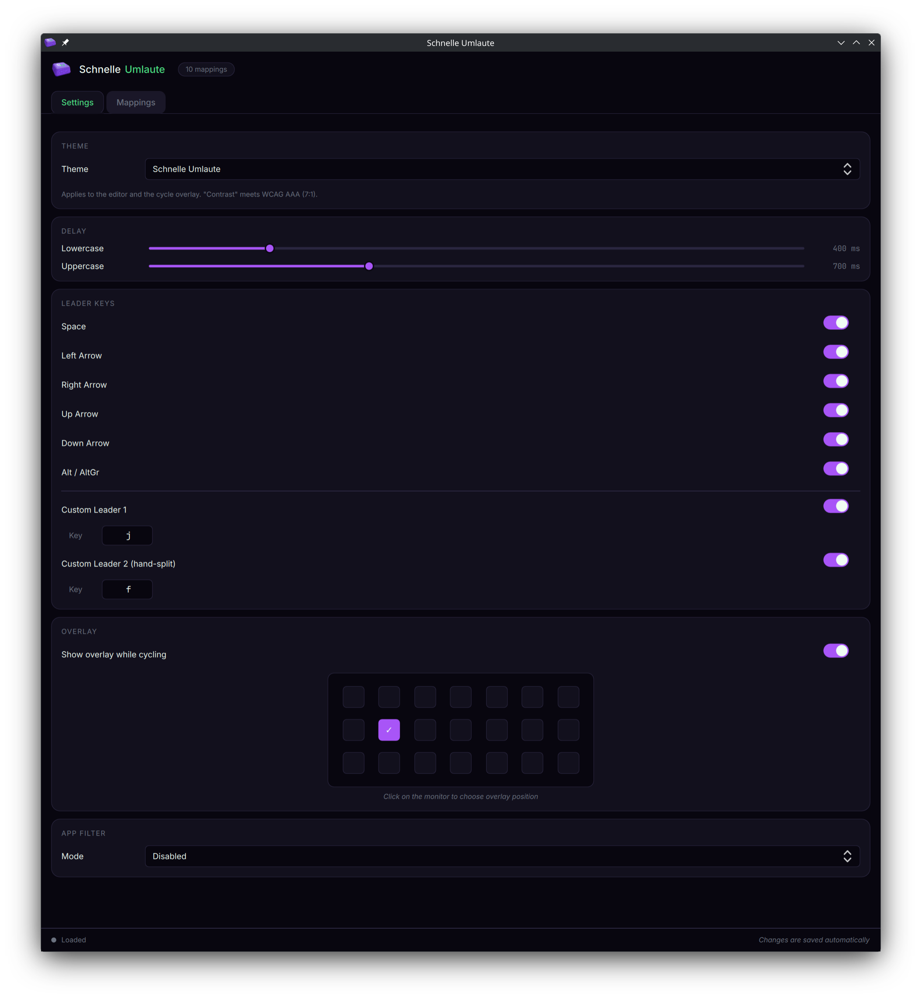
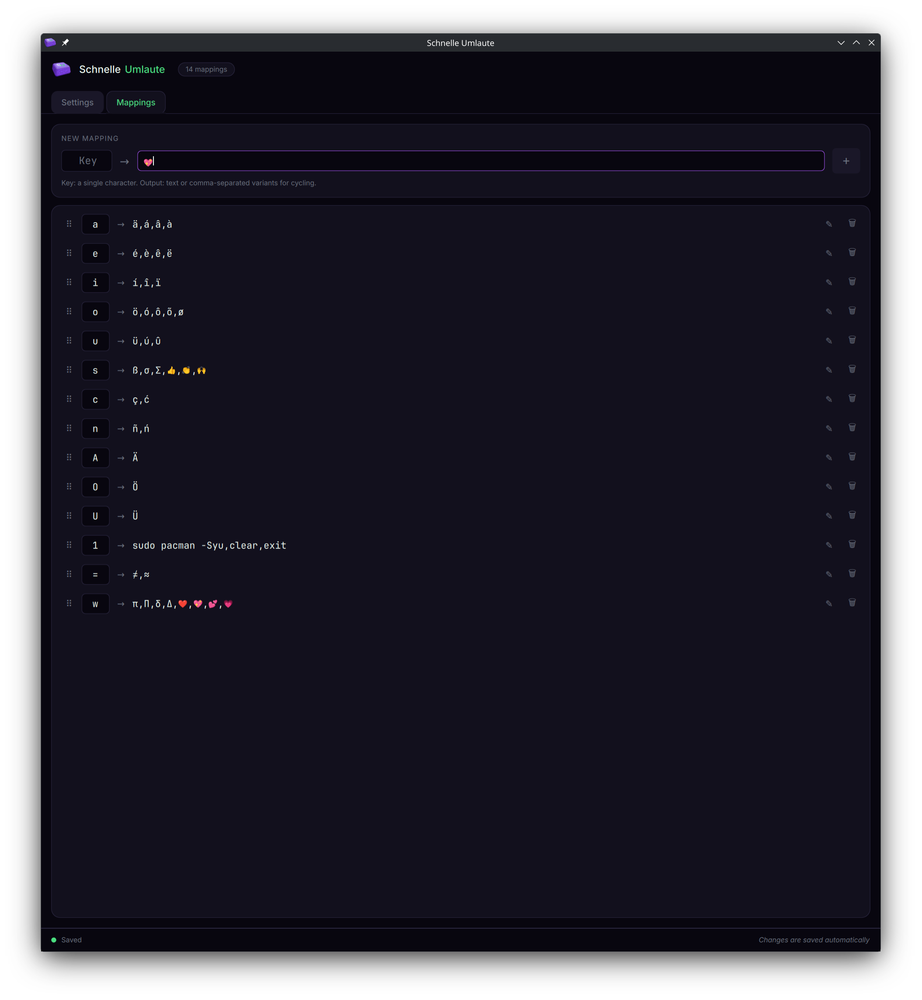
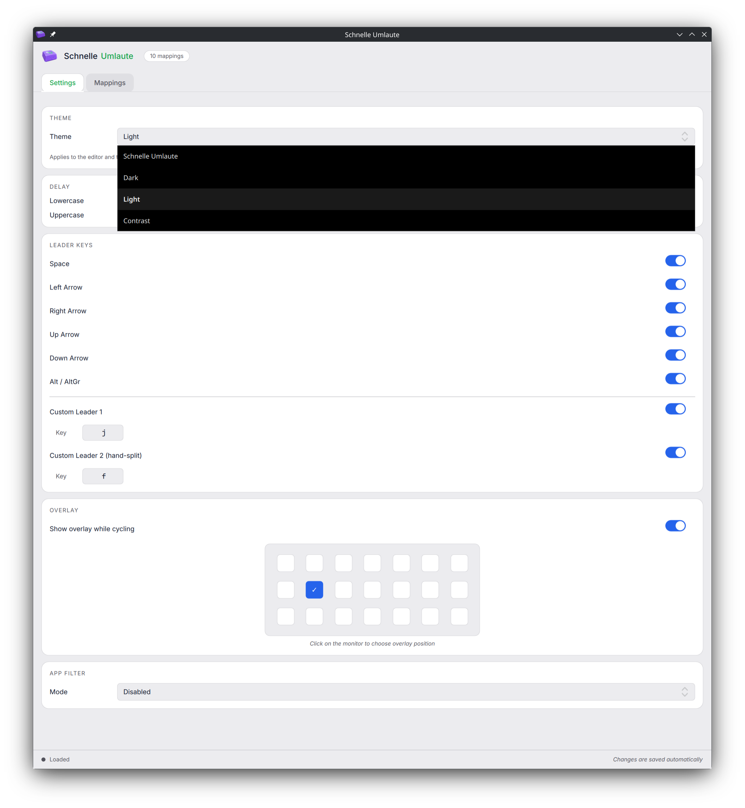

# Configuration

All addon settings can be changed in two ways:

- **Standalone editor** (recommended): launch `schnelle-umlaute-editor` from a terminal, an application launcher, or by clicking the gear/Configure button next to the addon in `fcitx5-config-qt`. All paths open the same Qt-based editor.
- **Config files**: settings and mappings are stored in two separate locations:
  - `~/.config/fcitx5/conf/schnelle-umlaute.conf` — delays, leader keys, app filter, overlay, theme (INI format)
  - `~/.config/fcitx5/schnelle-umlaute/mappings.txt` — character mappings (`Input=Output`, one per line)

Saves through the editor are **applied live** via fcitx5's `Controller1.ReloadAddonConfig` DBus call — no restart needed. After a manual edit of the config files, reload with `fcitx5-remote -r`.

---

## Launching the editor

You can open `schnelle-umlaute-editor` in three equivalent ways:

| Method | How |
|---|---|
| **Application launcher** | Search "Schnelle Umlaute Editor" in your DE's app menu (Plasma Search / KRunner / GNOME Activities / rofi / wofi) |
| **Command line** | Run `schnelle-umlaute-editor` from any terminal |
| **fcitx5-config-qt** | Open `fcitx5-config-qt`, select **Schnelle Umlaute** in the Input Method list, click the **gear/Configure** button next to it |

All three open the same editor window — pick whichever fits your workflow.

---

## Adding Schnelle Umlaute to your Input Methods

1. Open Fcitx5 configuration: `fcitx5-config-qt`
2. Go to **"Input Method"** tab
3. Click **"Add Input Method..."** and search for **"Schnelle Umlaute"**
4. Add it to your input methods and click **"Apply"**

| KDE System Settings | fcitx5-config-qt |
|:-:|:-:|
|  |  |

The gear/Configure button next to the entry launches the standalone editor.

---

## Fcitx5 Global Settings

These settings are not part of the addon itself, but they affect how it works. Open `fcitx5-config-qt` → **"Global Options"** tab (or KDE System Settings → Input Method → Global Options).

| KDE System Settings | fcitx5-config-qt |
|:-:|:-:|
|  |  |

| Setting | Recommended | Why |
|---------|-------------|-----|
| **Trigger Key** | <kbd>Ctrl</kbd>+<kbd>Space</kbd> | Switches between your base layout and Schnelle Umlaute. You can change it to any key combination. |
| **Share Input State** | All | Keeps Schnelle Umlaute active across all windows. Without this, you may need to toggle the addon in each window separately. |
| **Preedit** | enabled (default) | Shows a live preview of the current character before it's committed. Disabling it removes the visual feedback during gestures. |

---

## Keyboard Layout Requirement

This addon is **not a standalone keyboard layout** — it works **alongside** your existing keyboard layout.

**You always need a base keyboard layout** (e.g., US) in your Fcitx5 configuration. The addon:
- Receives characters that are already translated by your base layout
- Only modifies the configured input keys
- Passes all other keys through unchanged

---

## The Standalone Editor

The editor has two tabs: **Settings** (delays, leader keys, app filter, overlay, theme) and **Mappings** (the input → output list).



Changes are saved automatically and applied live — the bottom-right corner shows "Changes are saved automatically", and the bottom-left status indicator shows "Loaded" once the addon picks them up.



The Mappings tab uses a dynamic list — add as many entries as you need with the **+** button at the top, remove them with the trash icon, drag the handle on the left to reorder. Each row has a gear icon for additional per-entry actions.

---

## Delays

Customize the timing delays to match your typing speed. Each delay is a window `[min, max]`: the leader (e.g. <kbd>Space</kbd>) only triggers an accent if it arrives **after** the minimum hold and **before** the maximum. In the editor the two delay sliders are range sliders (drag the line between the handles to move the whole window).

| Setting | Default | Description |
|---------|---------|-------------|
| **Lowercase** | 400 ms | Upper bound of the window for lowercase gestures |
| **Uppercase** | 700 ms | Upper bound for uppercase gestures (longer because <kbd>Shift</kbd> + Letter + <kbd>Space</kbd> requires more coordination) |
| **LowercaseMin** | 0 ms | Minimum hold for lowercase: a leader arriving earlier yields the plain character |
| **UppercaseMin** | 0 ms | Minimum hold for uppercase gestures |

Valid range: 50–2000 ms for the upper bounds, 0–2000 ms for the minimum-hold lower bounds; both in 10 ms steps. The lower bounds default to 0 (no minimum). A degenerate config with `min >= max` makes the accent unreachable, so the engine ignores such a lower bound.

```ini
[Delay]
Lowercase=400
Uppercase=700
LowercaseMin=0
UppercaseMin=0
```

**Tips:**
- Start with defaults and adjust if needed
- Faster typists may prefer shorter delays (300/600 ms)
- Slower, more deliberate typing benefits from longer delays (500/800 ms)
- Raise the minimum hold (e.g. 80 ms) if quick deliberate <kbd>Space</kbd> presses trigger accents by accident

---

## Leader Key

Customize which keys activate the umlaut transformation. Multiple leader keys can be enabled at the same time.

| Option | Default | Key |
|--------|---------|-----|
| **Space** | enabled | <kbd>Space</kbd> |
| Left | disabled | <kbd>←</kbd> |
| Right | disabled | <kbd>→</kbd> |
| Up | disabled | <kbd>↑</kbd> |
| Down | disabled | <kbd>↓</kbd> |
| Alt | disabled | <kbd>Alt</kbd> / <kbd>AltGr</kbd> |
| Custom Leader 1 | disabled | Any single key |
| Custom Leader 2 | disabled | Any single key (hand-split) |

```ini
[Leader]
Space=True
Left=False
Right=False
Up=False
Down=False
Alt=False

[Leader/Custom]
CustomKeyEnabled=False
CustomKey=
CustomKey2Enabled=False
CustomKey2=
```

> **Alt / AltGr Leader**
> Enables <kbd>Alt</kbd> (Left/Right Alt) and <kbd>AltGr</kbd> (ISO_Level3_Shift on EU layouts) as leader keys. On KWin Wayland, auto-repeat sends release-press pairs which can cause input leaks. Works reliably under XIM (e.g. WezTerm).

> **Custom Leader Keys**
> Assign one or two single characters as additional leader keys (e.g. `f`, `j`). Multi-character input is trimmed to the first UTF-8 character, whitespace is ignored. Matching is case-insensitive for ASCII letters, so <kbd>Shift</kbd>+<kbd>f</kbd> matches custom leader `f`.
>
> When both custom leaders are set on **opposite keyboard halves** (US QWERTY), dual-split mode activates: each leader only triggers mappings on the other hand (e.g. left-hand leader `;` triggers right-hand inputs `u`, `o`, `i`). Same-hand or identical keys disable the split — both trigger all mappings.
>
> **Note:** A custom leader key must not be a mapped input key — it cannot trigger its own mapping. The editor surfaces a warning if a conflict is detected.

---

## Character Mappings

The addon uses a **dynamic mapping list** — add as many input → output mappings as you need. Defaults are German umlauts (a/o/u/s and their Shifted forms — see [README](../README.md)).

In the editor's **Mappings** tab, type the input character in the Key field, the output (or comma-separated cycling variants) in the Output field, and press the **+** button to add. Existing rows can be edited inline; reorder by dragging the handle on the left, remove with the trash icon.

Mappings are stored in a separate file using `Input=Output` format (one mapping per line):

```
# ~/.config/fcitx5/schnelle-umlaute/mappings.txt

a=ä
o=ö
u=ü
s=ß
A=Ä
O=Ö
U=Ü
e=é
n=ñ
```

> **Note:** Only the first `=` is used as separator — output values can contain `=` characters.

**Quick examples:** Any Unicode character works as output — French accents (é, è, ê), Spanish (ñ, á), Greek letters (π, Ω, Δ), emojis (❤️, 👍, 😊), Braille (⠁⠃⠉), math symbols (±, ≠, ∞). See [Accent Cycling](#accent-cycling) for multi-variant mappings and [Snippets](#snippets-text-expansion) for text expansion.

---

## Accent Cycling

Cycle through multiple variants by pressing the leader key repeatedly. Define all variants in a single Output field separated by commas.

**How it works:**

1. Hold the input key (e.g., <kbd>e</kbd>)
2. Press leader key (<kbd>Space</kbd>) → first variant appears (e.g., `é`)
3. Press leader key again → next variant (e.g., `è`)
4. Keep pressing → cycles through all variants (è → ê → ë → é → …)
5. Release input key → cycling stops, current selection is committed

In the editor, enter comma-separated variants in any Output field (e.g., `é,è,ê,ë` for Input `e`). To include a literal comma in an output, use double comma (`,,`) as escape — see [Snippets](#snippets-text-expansion) for details.

**Config file example:**

```
# ~/.config/fcitx5/schnelle-umlaute/mappings.txt

a=ä
e=é,è,ê,ë
a=á,à,â,ã,å
c=ç,ć,č
```

> **Note:** Comma-separated values in the Output define cycling variants.

**Example cycling mappings:**

Cycling works with any Unicode characters — accents, emojis, symbols, Greek letters.

| Input | Output | Cycling sequence |
|-------|--------|------------------|
| <kbd>e</kbd> | é,è,ê,ë | é → è → ê → ë → é → … |
| <kbd>a</kbd> | á,à,â,ã,å | á → à → â → ã → å → á → … |
| <kbd>n</kbd> | ñ,ń,ň | ñ → ń → ň → ñ → … |
| <kbd>o</kbd> | ó,ò,ô,õ,ø | ó → ò → ô → õ → ø → ó → … |
| <kbd>s</kbd> | 😊,😀,😁,🙂 | 😊 → 😀 → 😁 → 🙂 → 😊 → … |
| <kbd>p</kbd> | π,Σ,Ω,Δ,μ | π → Σ → Ω → Δ → μ → π → … |

---

## Snippets (Text Expansion)

Map a single key to an entire phrase or longer text. Useful for frequently typed words, signatures, or boilerplate text.

| Input | Output | Use case |
|-------|--------|----------|
| <kbd>g</kbd> | Guten Tag | German greeting |
| <kbd>m</kbd> | Mit freundlichen Grüßen | Email signature |
| <kbd>@</kbd> | name@example.com | Email address |
| <kbd>t</kbd> | TODO: | Code annotation |
| <kbd>g</kbd> | ggVGy | Neovim: select all + yank (works in normal mode) |

```
# ~/.config/fcitx5/schnelle-umlaute/mappings.txt

g=Guten Tag
m=Mit freundlichen Grüßen
@=name@example.com
```

Hold <kbd>g</kbd> + press <kbd>Space</kbd> → "Guten Tag" is inserted.

**Commas in snippets:** Since commas separate cycling variants, use double comma (`,,`) to include a literal comma in your output:

```
h=Hello,, World
l=a,, b,, c
```

| Config value | Result |
|---|---|
| `Hello,, World` | Hello, World |
| `a,, b,, c` | a, b, c |
| `x,,y,z` | Cycling: x,y → z |
| `,,,` | Single output: , |

---

## Theme

The editor and the cycle overlay share a theme. Pick one from the dropdown in the Settings tab.



| Theme | Description |
|---|---|
| **Schnelle Umlaute** (default) | Project signature — dark with violet accent |
| **Dark** | Neutral dark palette |
| **Light** | Neutral light palette |
| **Contrast** | High-contrast palette meeting WCAG AAA (7:1) |

```ini
[Theme]
Theme=schnelle-umlaute
```

The theme applies to both the editor window and the on-screen cycle overlay (when enabled), so they share a consistent look.

---

## Cycle Overlay

> **Not available on GNOME or X11.** The overlay needs the **wlr-layer-shell** Wayland protocol. GNOME's Mutter does not implement it, and X11 has no equivalent. The editor greys out the Overlay toggle on those sessions. Cycling itself works everywhere — only the visual on-screen indicator is gated.

An optional on-screen indicator that mirrors the current variant while you cycle. Toggle it in the editor's **Settings → Overlay**, then click on the position grid to choose where it appears on screen.

| Setting | Default | Description |
|---------|---------|-------------|
| **Enabled** | `False` | Master switch for the overlay |
| **ShowOnTrigger** | `False` | Preview all mapped keys in the trigger window, not just the variants currently being cycled |
| **AtCursor** | `False` | Anchor the overlay at the mouse pointer instead of the Row/Column grid. The grid stays as the fallback on compositors that can't report the cursor |
| **ProgressBar** | `False` | Draw a timing bar for the accent gesture: a lead-in segment (min-hold) fills, then the `[min, max]` leader window counts down |
| **Row** | `Top` | Vertical grid position when not following the cursor: `Top`, `Center`, `Bottom` |
| **Column** | `Col4` | Horizontal grid position: `Col1` (far left) … `Col4` (center) … `Col7` (far right) |

```ini
[Overlay]
Enabled=True
ShowOnTrigger=False
AtCursor=False
ProgressBar=False
Row=Center
Column=Col1
```

The overlay is provided by a separate daemon (`schnelle-umlaute-overlay`) that the addon starts on demand via DBus auto-activation — there is no autostart entry, the daemon only runs while the overlay is enabled. When you toggle it off in the editor, the addon calls `Quit()` on the daemon.

The overlay relies on the **wlr-layer-shell** Wayland protocol. The editor detects your session at launch and disables the toggle on compositors that can't host layer-shell surfaces:

| Session | Overlay |
|---|---|
| KDE Plasma (Wayland) | ✅ supported |
| sway, Hyprland, river, wayfire, niri, LabWC | ✅ supported |
| **GNOME (Wayland)** | ❌ Mutter does not implement wlr-layer-shell |
| **X11 sessions** (any DE) | ❌ layer-shell is Wayland-only |

Cycling itself works on every session — only the visual indicator is gated on compositor support. On unsupported sessions the toggle is greyed out with a one-line explanation, and the addon skips the overlay's DBus activation even if `Enabled=True` is set manually in the config file.

---

## App Filter

Disable Schnelle Umlaute in specific applications. Useful for games, password managers, IP/number-only input fields, or any app whose own shortcuts collide with the gesture input.

| Mode | Behavior |
|------|----------|
| **Disabled** (default) | Active in every app |
| **Blacklist** | Active everywhere **except** in listed apps |
| **Whitelist** | Active **only** in listed apps |

```ini
[AppFilter]
Mode=Blacklist

[AppFilter/Blacklist]
0=steam
1=keepassxc

[AppFilter/Whitelist]
```

Apps are matched against fcitx5's program identifier (typically the X11 `WM_CLASS` or the Wayland app-id — e.g. `firefox`, `libreoffice`, `discord`) using a **case-sensitive substring** match. Empty list entries are ignored, so an accidental blank line won't disable the addon.

> **Tip — Finding an app's identifier**
> Run `dbus-send --session --dest=org.fcitx.Fcitx5 --print-reply /controller org.fcitx.Fcitx.Controller1.DebugInfo 2>/dev/null | grep "program:"` to list all identifiers that fcitx5 actually sees.
> On X11, the identifier is typically the `WM_CLASS`. On Wayland, it is usually the app-id (e.g. `firefox`, `org.mozilla.firefox`).
> **Note:** Some apps report the name of their GUI library instead of their own name. For example, Kitty uses GLFW and appears as `GLFW_Application`, not `kitty`. Always verify with the command above.

> **Substring caveat**
> A short pattern matches broadly: `term` will also catch `gnome-terminal`, `xterm`, `terminator`, `lxterminal`. Use a more specific pattern (e.g. `xterm` or the full app-id) if that's a problem.
