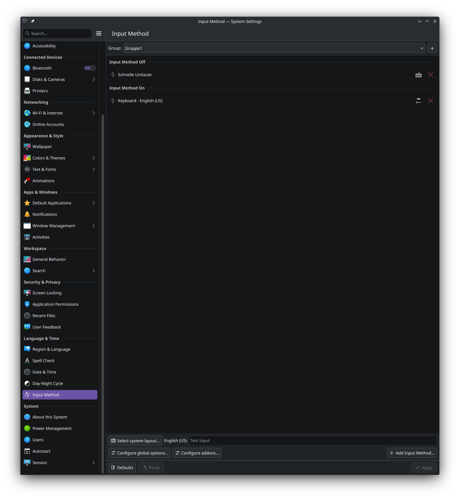
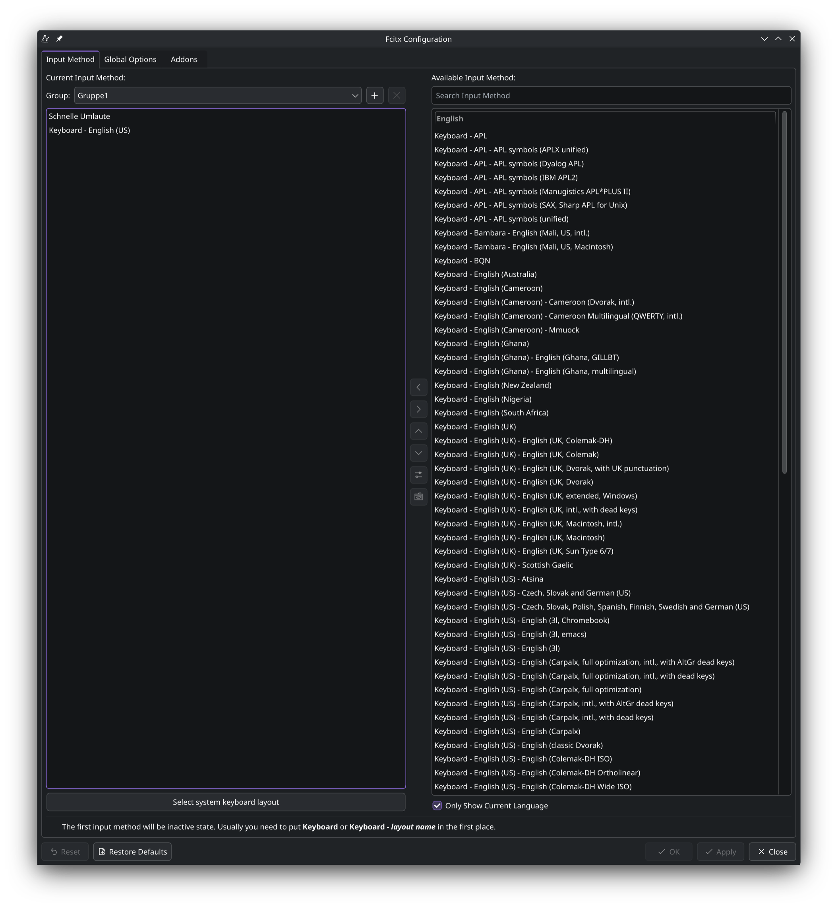
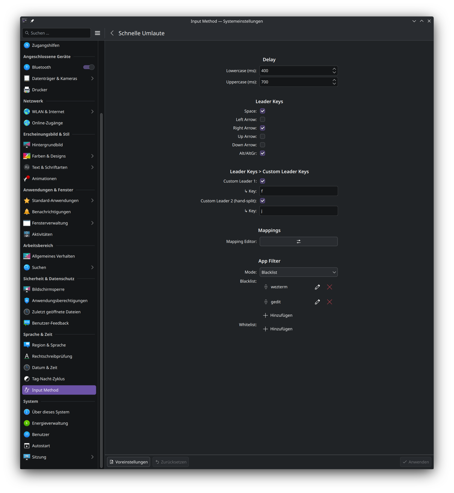
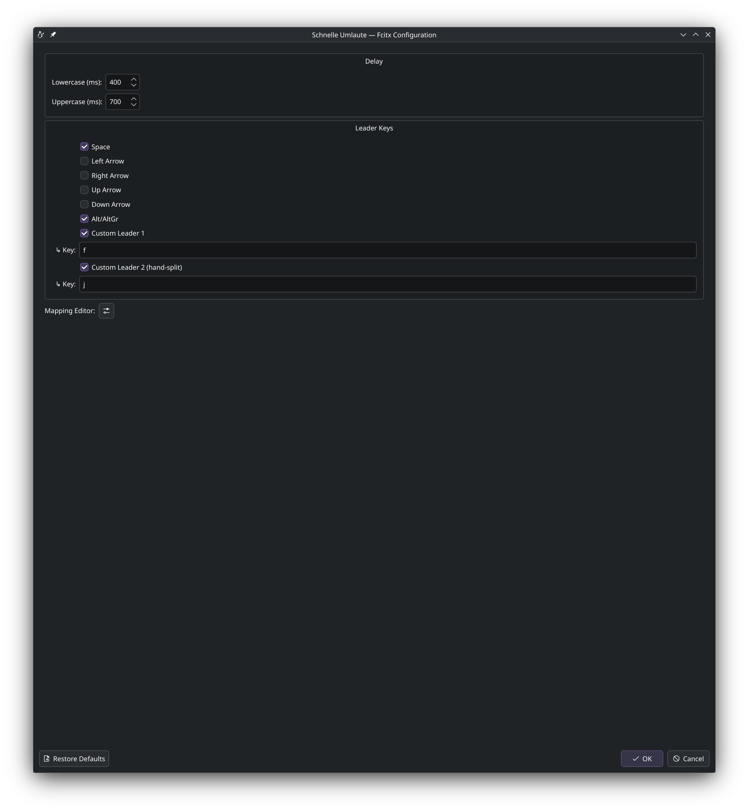
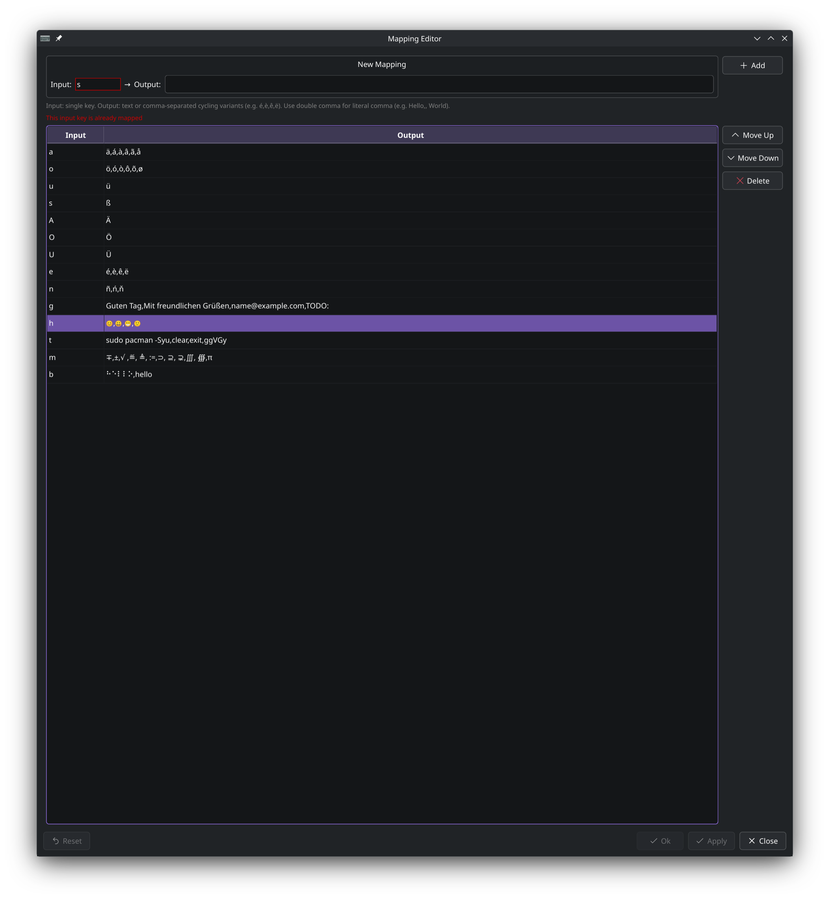

# Configuration

All addon settings can be changed in two ways:

- **Via GUI** (recommended): `fcitx5-config-qt` → select "Schnelle Umlaute" → click **Configure** (wrench icon)
- **Via config files**: Settings and mappings are stored in two separate locations:
  - `~/.config/fcitx5/conf/schnelle-umlaute.conf` — Delays and Leader Keys (INI format)
  - `~/.config/fcitx5/schnelle-umlaute/mappings.txt` — Character Mappings (`Input=Output`, one per line)

**After config file changes**, restart Fcitx5 with `fcitx5 -r`. GUI changes apply immediately after clicking Apply.

---

## Adding Schnelle Umlaute to your Input Methods

1. Open Fcitx5 configuration: `fcitx5-config-qt`
2. Go to **"Input Method"** tab
3. Click **"Add Input Method..."** and search for **"Schnelle Umlaute"**
4. Add it to your input methods and click **"Apply"**

| KDE System Settings | fcitx5-config-qt |
|:-:|:-:|
|  |  |

---

## Fcitx5 Global Settings

These settings are not part of the addon itself, but they affect how it works. Open `fcitx5-config-qt` → **"Global Options"** tab (or KDE System Settings → Input Method → Global Options).

| KDE System Settings | fcitx5-config-qt |
|:-:|:-:|
|  |  |

| Setting | Recommended | Why |
|---------|-------------|-----|
| **Trigger Key** | <kbd>Ctrl</kbd>+<kbd>Space</kbd> | Switches between your base layout and Schnelle Umlaute. You can change it to any key combination. |
| **Share Input State** | All | Keeps Schnelle Umlaute active across all windows. Without this, you may need to toggle the addon in each window separately. |
| **Preedit** | enabled (default) | Shows a live preview of the current character before it's committed. Disabling it removes the visual feedback during gestures. |

---

## Keyboard Layout Requirement

This addon is **not a standalone keyboard layout** - it works **alongside** your existing keyboard layout.

**You always need a base keyboard layout** (e.g., US) in your Fcitx5 configuration. The addon:
- Receives characters that are already translated by your base layout
- Only modifies the configured keys (a, o, u, s, etc.)
- Passes all other keys through unchanged

---

| KDE System Settings | fcitx5-config-qt |
|:-:|:-:|
|  |  |

## Delays

Customize the timing delays to match your typing speed:

| Setting | Default | Description |
|---------|---------|-------------|
| **DelayLowercase** | 400ms | Time window for lowercase gestures |
| **DelayUppercase** | 700ms | Time window for uppercase gestures (longer because <kbd>Shift</kbd> + Letter + <kbd>Space</kbd> requires more coordination) |

Valid range: 50-2000ms, any exact value accepted.

```ini
[Delay]
Lowercase=400
Uppercase=700
```

**Tips:**
- Start with defaults and adjust if needed
- Faster typists may prefer shorter delays (300ms/600ms)
- Slower, more deliberate typing benefits from longer delays (500ms/800ms)

---

## Leader Key

Customize which keys activate the umlaut transformation. Multiple leader keys can be enabled at the same time.

| Option | Default | Key |
|--------|---------|-----|
| **Space** | enabled | <kbd>Space</kbd> |
| Left | disabled | <kbd>←</kbd> |
| Right | disabled | <kbd>→</kbd> |
| Up | disabled | <kbd>↑</kbd> |
| Down | disabled | <kbd>↓</kbd> |
| Alt | disabled | <kbd>Alt</kbd> / <kbd>AltGr</kbd> |
| Custom Leader 1 | disabled | Any single key |
| Custom Leader 2 | disabled | Any single key (hand-split) |

```ini
[Leader]
Space=True
Left=False
Right=False
Up=False
Down=False
Alt=False
CustomKeyEnabled=False
CustomKey=
CustomKey2Enabled=False
CustomKey2=
```

> **Alt / AltGr Leader**
> Enables <kbd>Alt</kbd> (Left/Right Alt) and <kbd>AltGr</kbd> (ISO_Level3_Shift on EU layouts) as leader keys. On KWin Wayland, auto-repeat sends release-press pairs which can cause input leaks. Works reliably under XIM (e.g. WezTerm).

> **Custom Leader Keys**
> Assign one or two single characters as additional leader keys (e.g. `f`, `j`). Multi-character input is trimmed to the first UTF-8 character, whitespace is ignored. Matching is case-insensitive for ASCII letters, so <kbd>Shift</kbd>+<kbd>f</kbd> matches custom leader `f`.
>
> When both custom leaders are set on **opposite keyboard halves** (US QWERTY), dual-split mode activates: each leader only triggers mappings on the other hand (e.g. left-hand leader `;` triggers right-hand inputs `u`, `o`, `i`). Same-hand or identical keys disable the split — both trigger all mappings.
>
> **Note:** A custom leader key must not be a mapped input key — it cannot trigger its own mapping. The config GUI shows a warning if a conflict is detected.

---

## Character Mappings



The addon uses a **dynamic mapping list** — add as many input→output mappings as you need. The first 7 entries are pre-configured with German umlauts (see default mappings in the [README](../README.md)).

In the GUI, the mappings are shown as an inline list with Input → Output fields. Use the **+** button to add new entries, the **×** button to remove them, and drag handles to reorder. Click **"Defaults"** to restore German umlauts.

Mappings are stored in a separate file using `Input=Output` format (one mapping per line):

```
# ~/.config/fcitx5/schnelle-umlaute/mappings.txt

a=ä
o=ö
u=ü
s=ß
A=Ä
O=Ö
U=Ü
e=é
n=ñ
```

> **Note:** Only the first `=` is used as separator — Output values can contain `=` characters.

**Quick examples:** French accents (é, è, ê), Spanish (ñ, á), Math symbols (π, ∂), Braille characters (⠁⠃⠉). See sections below for Accent Cycling, Snippets, and Emoji mappings.

---

## Accent Cycling

Cycle through multiple accent variants by pressing the leader key repeatedly. Instead of creating separate mappings for each variant, define all variants in a single Output field separated by commas.

**How it works:**
1. Hold the input key (e.g., <kbd>e</kbd>)
2. Press leader key (<kbd>Space</kbd>) → first variant appears (e.g., `é`)
3. Press leader key again → next variant (e.g., `è`)
4. Keep pressing → cycles through all variants (è → ê → ë → é → ...)
5. Release input key → cycling stops, current selection is kept

In the GUI, enter comma-separated variants in any Output field (e.g., `é,è,ê,ë` for Input `e`). To include a literal comma in an output, use double comma (`,,`) as escape — see [Snippets](#snippets-text-expansion) for details.

**Config file example:**

```
# ~/.config/fcitx5/schnelle-umlaute/mappings.txt

a=ä
e=é,è,ê,ë
a=á,à,â,ã,å
c=ç,ć,č
```

> **Note:** Comma-separated values in the Output define cycling variants.

**Example cycling mappings:**

| Input | Output | Cycling sequence |
|-------|--------|------------------|
| <kbd>e</kbd> | é,è,ê,ë | é → è → ê → ë → é → ... |
| <kbd>a</kbd> | á,à,â,ã,å | á → à → â → ã → å → á → ... |
| <kbd>n</kbd> | ñ,ń,ň | ñ → ń → ň → ñ → ... |
| <kbd>o</kbd> | ó,ò,ô,õ,ø | ó → ò → ô → õ → ø → ó → ... |

---

## Snippets (Text Expansion)

Map a single key to an entire phrase or longer text. Useful for frequently typed words, signatures, or boilerplate text.

| Input | Output | Use case |
|-------|--------|----------|
| <kbd>g</kbd> | Guten Tag | German greeting |
| <kbd>m</kbd> | Mit freundlichen Grüßen | Email signature |
| <kbd>@</kbd> | name@example.com | Email address |
| <kbd>t</kbd> | TODO: | Code annotation |
| <kbd>g</kbd> | ggVGy | Neovim: select all + yank (works in normal mode) |

```
# ~/.config/fcitx5/schnelle-umlaute/mappings.txt

g=Guten Tag
m=Mit freundlichen Grüßen
@=name@example.com
```

Hold <kbd>g</kbd> + press <kbd>Space</kbd> → "Guten Tag" is inserted.

**Commas in snippets:** Since commas separate cycling variants, use double comma (`,,`) to include a literal comma in your output:

```
h=Hello,, World
l=a,, b,, c
```

| Config value | Result |
|---|---|
| `Hello,, World` | Hello, World |
| `a,, b,, c` | a, b, c |
| `x,,y,z` | Cycling: x,y → z |
| `,,,` | Single output: , |

---

## Emoji Mappings

Map keys to emoji for quick insertion without opening an emoji picker.

**Examples:**

| Input | Output | Description |
|-------|--------|-------------|
| <kbd>h</kbd> | ❤️ | Heart |
| <kbd>t</kbd> | 👍 | Thumbs up |
| <kbd>s</kbd> | 😊 | Smile |
| <kbd>c</kbd> | ✓ | Checkmark |

Emoji cycling also works: set Output to `😊,😀,😁,🙂` to cycle through smileys.
