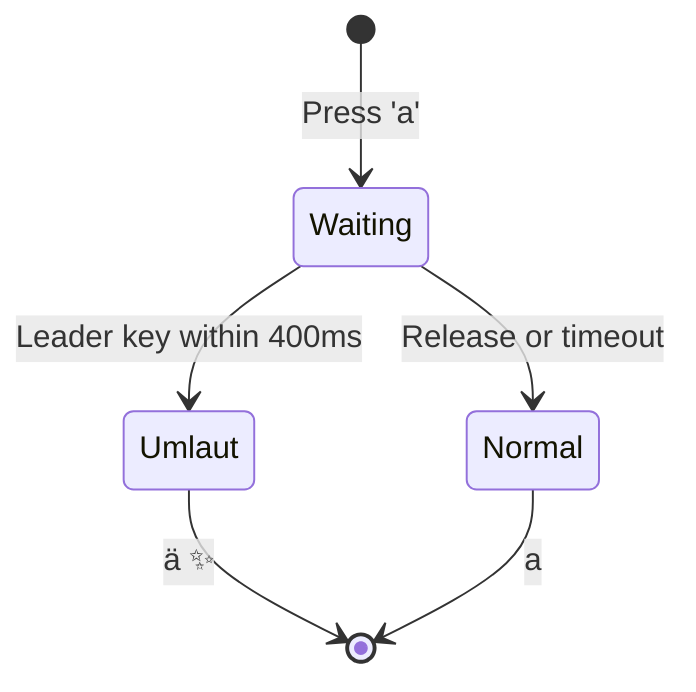
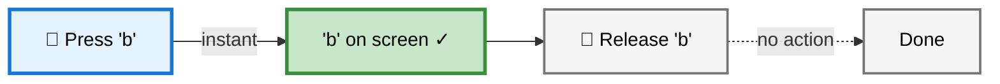
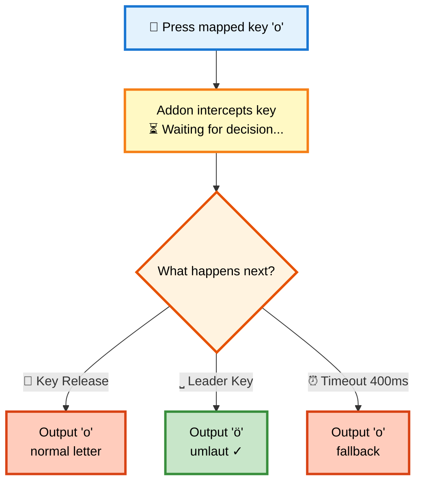
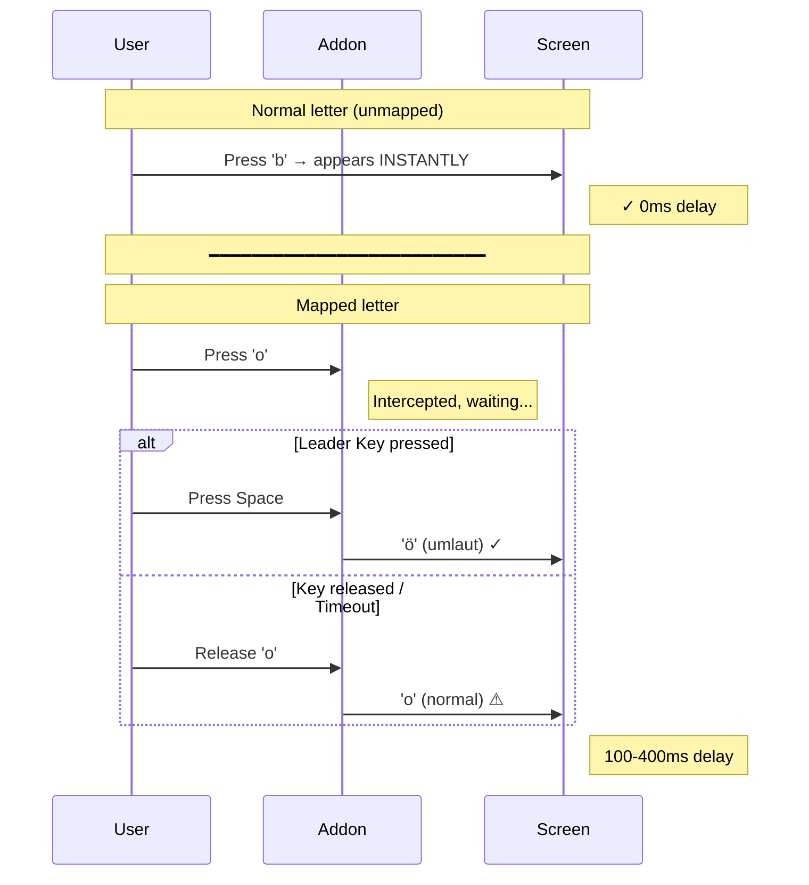

# How It Works

## Gesture Flow

**Note:** Leader key is <kbd>Space</kbd> by default. You can configure it to Arrow keys (<kbd>←</kbd><kbd>→</kbd><kbd>↑</kbd><kbd>↓</kbd>), <kbd>Alt</kbd>/<kbd>AltGr</kbd>, or custom keys in `fcitx5-config-qt`.

## Why Does Typing Feel Different?

This addon works differently than normal typing. Understanding this helps you adapt faster.

### Scenario 1: Normal Letter (unmapped, e.g. 'b', 'c', 'd')

**Timing:** 0ms delay - Output on **Press** ✓

---

### Scenario 2: Mapped Letter (a, o, u, s) - The Decision Point

The addon intercepts the key and waits to see what happens next:

**Timing:** 100-400ms delay - Output depends on user action ⚠

---

### The Critical Difference: Timing Expectation

### Quick Comparison

| Action | Normal Letter | Mapped Letter (a,o,u,s) |
|--------|--------------|------------------------|
| **Output Trigger** | Key **Press** | Key **Release** or Leader Key |
| **Timing** | Instant (0ms) | Delayed (100-400ms) |
| **Feel** | Direct feedback | Slight "lag" |

**Why the delay?** The addon must wait after a mapped key press to determine whether the leader key follows (→ accent) or the key is simply released (→ normal letter).
