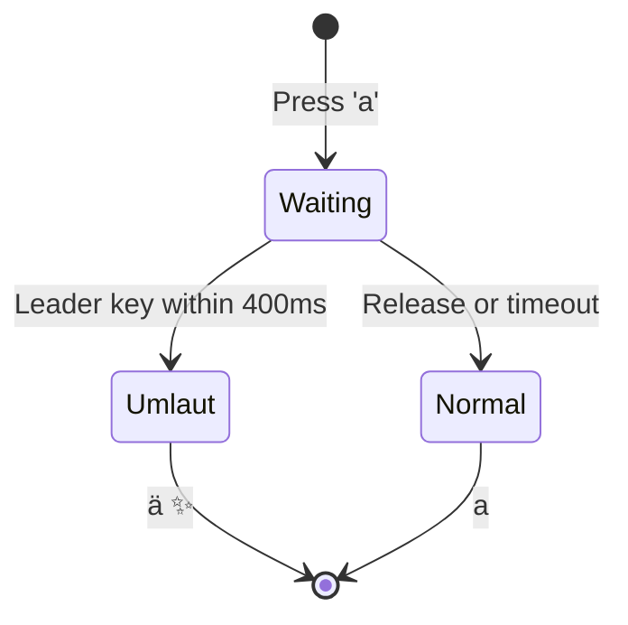
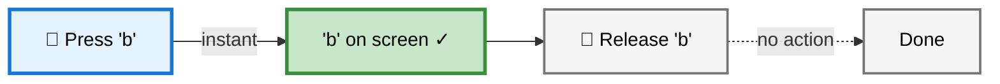
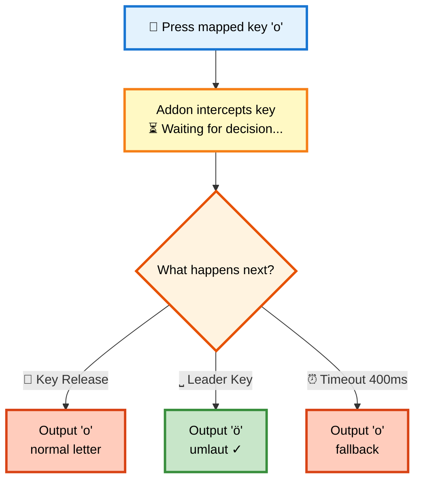
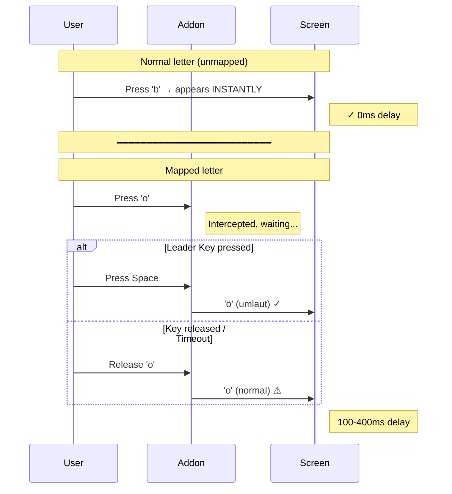
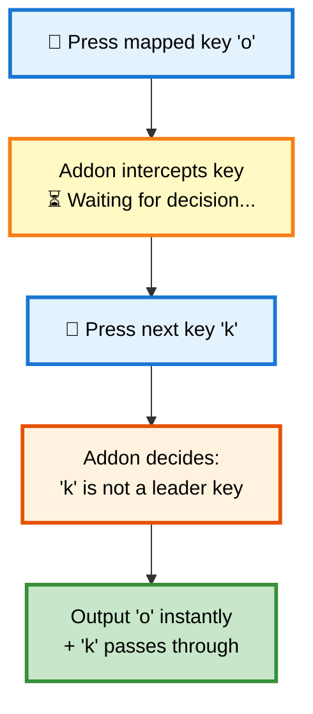
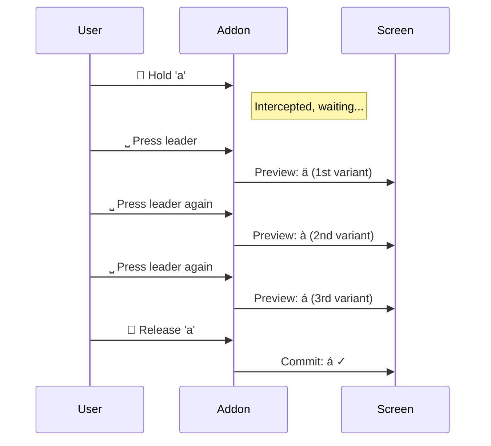
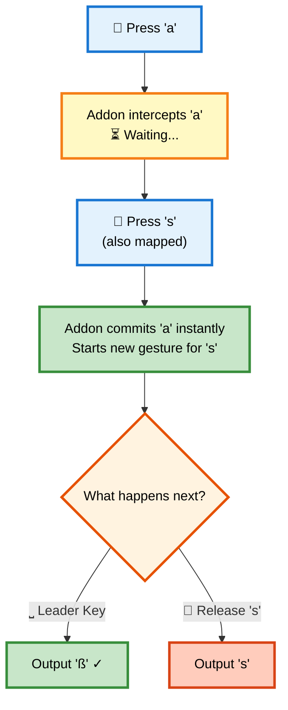

# How It Works

## How does this compare to other accent input methods?

Typing accented characters on Linux has long been possible — but every existing method breaks the touch-typing flow somewhere. This addon was built to fill that gap.

| Method | Rhythm break? | Mode switch? | Layout switch? | Learning curve |
|---|---|---|---|---|
| Compose key | Yes (syntax `" a`) | Yes | No | Medium |
| Dead keys | Yes (dedicated key) | Yes | No | Small |
| AltGr layouts (Neo, US-Intl) | No | No | **Yes** (entire layout) | High |
| Mobile long-press (Android/iOS) | Yes (popup wait) | Yes | — | Small |
| **Schnelle Umlaute** | **No** | **No** | **No** | Small |

**Not a mobile long-press on the desktop.** On a phone you press a key and *wait* 200–500 ms for a popup to appear, then tap or swipe to pick a variant. This addon has **no wait**: you press the mapped key and the leader key in the natural rhythm of touch typing — both keypresses can overlap, exactly as they already do while typing any two adjacent letters quickly.

**Why this matters for touch typists.** The *hold-letter-then-press-leader* pattern is not a new motor skill. A touch typist already produces small timing overlaps between neighbouring finger movements all day long. The addon gives that existing overlap a meaning; it does not ask the typist to slow down, switch modes, or relearn a keyboard layout.

## Gesture Flow

**Note:** Leader key is <kbd>Space</kbd> by default. You can configure it to Arrow keys (<kbd>←</kbd><kbd>→</kbd><kbd>↑</kbd><kbd>↓</kbd>), <kbd>Alt</kbd>/<kbd>AltGr</kbd>, or custom keys in `fcitx5-config-qt`.

## Why Does Typing Feel Different?

This addon works differently than normal typing. Understanding this helps you adapt faster.

### Scenario 1: Normal Letter (unmapped, e.g. 'b', 'c', 'd')

**Timing:** 0ms delay - Output on **Press** ✓

---

### Scenario 2: Mapped Letter (a, o, u, s) - The Decision Point

The addon intercepts the key and waits to see what happens next:

**Timing:** 100-400ms delay - Output depends on user action ⚠

---

### The Critical Difference: Timing Expectation

### Quick Comparison

| Action | Normal Letter | Mapped Letter (a,o,u,s) |
|--------|--------------|------------------------|
| **Output Trigger** | Key **Press** | Key **Release** or Leader Key |
| **Timing** | Instant (0ms) | Delayed (100-400ms) |
| **Feel** | Direct feedback | Slight "lag" |

**Why the delay?** The addon must wait after a mapped key press to determine whether the leader key follows (→ accent) or the key is simply released (→ normal letter).

---

### Scenario 3: Mapped Letter → Next Key (Fast Typing Shortcut)

When you type the next character before releasing the mapped key, the addon doesn't wait — it commits the mapped letter **immediately** and lets the next key through. This avoids the release delay entirely:

**Timing:** Near-instant — no need to wait for release or timeout. The next key press resolves the decision immediately. This means fast typists rarely notice the delay: as long as you keep typing, mapped letters flow through without any perceivable lag.

---

### Scenario 4: Accent Cycling (Multiple Variants)

When a mapping has multiple outputs (e.g. `a → ä, à, á, â, ã`), pressing the leader key repeatedly cycles through them:

The preview updates in the preedit area — nothing is committed until you release the input key. You can cycle as many times as you want.

---

### Scenario 5: New Mapped Key During Gesture

When you press a second mapped key while the first is still waiting, the addon commits the first one immediately and starts a new gesture for the second:

This means typing `a` `s` quickly just outputs "as" — you'd have to deliberately hold `a` and press Space to get "ä".
