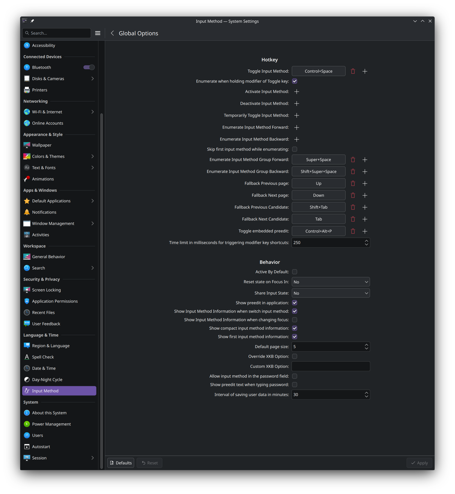
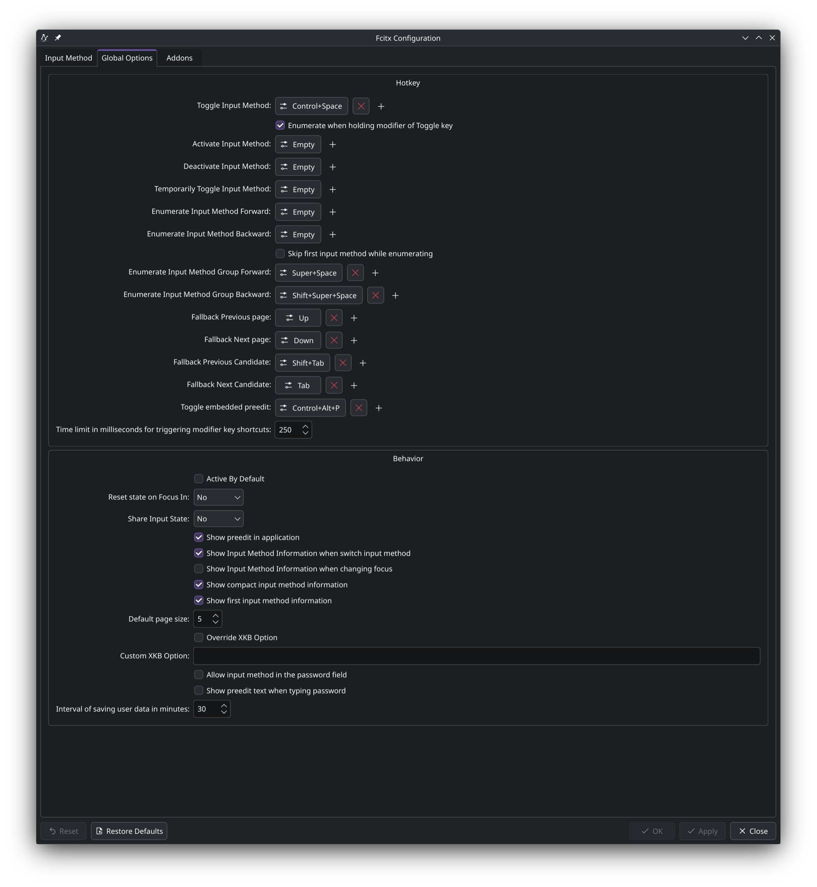

# Troubleshooting

## Accidental accents when typing fast

**Symptom:** When typing fast with Space as leader key, accents appear at word boundaries and the word separator is lost (the two words run together).

**Examples:**

| Language | Expected | Actual (fast typing) | Cause |
|----------|----------|---------------------|-------|
| German | Der Bus kommt gleich. | Der Bußkommt gleich. | `s` still held when Space is pressed → ß, Space consumed as leader |
| French | Je mange une pomme chaque jour. | Je mange une pomméchaque jour. | `e` still held when Space is pressed → é, Space consumed as leader |
| Spanish | El tren sale a las ocho. | El treñsale a las ocho. | `n` still held when Space is pressed → ñ, Space consumed as leader |

**Cause:** Space serves as both word separator and leader key. When typing quickly, the mapped key at the end of a word hasn't been released yet when Space is pressed, the addon interprets this as a hold+space gesture, outputs the accent, and consumes the Space as the leader trigger, so no word separator is emitted.

**Solution:** Switch to a leader key that doesn't conflict with normal typing:

- **Arrow keys** (<kbd>←</kbd><kbd>→</kbd><kbd>↑</kbd><kbd>↓</kbd>), dedicated, no conflict
- **Alt / AltGr**, dedicated, no conflict
- **Custom keys** (e.g. `f`, `j`), tested across multiple languages with few conflicts
- **Dual custom leaders** (hand-split), one leader per keyboard half, near-zero conflicts

See [Configuration → Leader Key](CONFIGURATION.md#leader-key) for setup instructions.

**Alternative solution (keep Space as leader):** Reduce the **Lowercase Delay** in `schnelle-umlaute-editor` → Settings (default 400 ms). Start with **200 ms** and only go lower (down to the 50 ms minimum) if accidental accents still occur. With a shorter window the mapped key times out before you reach Space, so the addon falls back to the "normal letter + space" path, no accidental accent, word separator preserved. Trade-off: you have less time to press Space when you actually want the accent.

## Addon stops working after moving/switching windows (fcitx5 5.1.18+)

KWin tiling scripts (e.g. [MouseTiler](https://github.com/rxappdev/MouseTiler)) can interfere with the addon, mapped keys stop producing output. Disable the tiling script to fix this.

## Uppercase mappings not working (Shift trigger conflict)

**Symptom:** Lowercase mappings (a → ä) work, but uppercase mappings (Shift+A → Ä) switch the input method instead.

**Cause:** Fcitx5 uses Shift as input method trigger key. When you press Shift+A, fcitx5 intercepts the Shift press to switch input methods before the addon can process it.

**Fix:** Change the trigger key in Fcitx5 settings:
1. Open `fcitx5-config-qt` → **Global Options** → **Trigger Input Method**
2. Remove any Shift-based triggers and use **Ctrl+Space** instead

> **Note:** The install script detects this conflict and offers to fix it automatically.

## Addon not showing in fcitx5-config-qt

Check if all files are installed:
```bash
ls /usr/lib/fcitx5/schnelle-umlaute.so
ls /usr/share/fcitx5/addon/schnelle-umlaute.conf
ls /usr/share/fcitx5/addon/schnelle-umlaute.conf.in  # For GUI config options
ls /usr/share/fcitx5/inputmethod/schnelle-umlaute.conf  # This is important!
```

If missing, reinstall:
```bash
cd addon/build
sudo cmake --install .
fcitx5-remote -r
```

## Configuration options not visible

If the addon appears in fcitx5-config-qt but the gear button doesn't open the editor, or the editor opens but lacks tabs:

1. Verify the editor binary is installed: `which schnelle-umlaute-editor`
2. Verify the addon's `[Editor] External=` entry: `grep -A1 '\[Editor\]' /usr/share/fcitx5/addon/schnelle-umlaute.conf.in`
3. If missing, reinstall the addon:
   ```bash
   cd addon && ./build.sh && cd build && sudo cmake --install . && fcitx5-remote -r
   ```

## Works in terminal but not in other apps (Firefox, Kate, etc.)

Environment variables must be set correctly. See the environment variables step in the [Installation Guide](INSTALLATION.md) for your platform.

Then **logout and login again** for changes to take effect.

## Premature or duplicate character when holding a mapped key (Qt apps under Wayland)

**Symptom:** In some Qt applications under a Wayland session (for example Kate, or LibreOffice), holding a mapped key emits the plain character before you can complete the accent, instead of waiting for the trigger window.

**Cause:** On Wayland the compositor delivers a held key's auto-repeat as synthetic release-press pairs rather than plain repeat presses. The release of such a pair looks like a real key release and used to commit the character early.

**Status:** The addon recognises these synthetic releases by their frozen frontend event timestamp (the compositor stamps the whole repeat burst with the original press time) and suppresses them, so Qt6-native apps such as Kate behave correctly. Fast typing is unaffected: a genuine keypress carries an advancing timestamp and commits immediately.

**LibreOffice:** LibreOffice is not a normal Qt application; its input path depends on the selected VCL backend, and the default backend can still emit the premature character. Switch LibreOffice to the Qt6 (or KF6) backend so it uses the same fixed input path. This applies on any distribution and has two parts:

1. **Install the Qt6/KF6 VCL plugin.** The package name varies by distribution, commonly `libreoffice-qt6` or `libreoffice-kf6` (some ship it inside the main LibreOffice package or as `libreoffice-kde`). Check your package manager.
2. **Select it** with the `SAL_USE_VCLPLUGIN` environment variable set to `qt6` (or `kf6`).

Quick test from a terminal, nothing permanent:

    SAL_USE_VCLPLUGIN=qt6 soffice

To make it permanent, export the variable for your graphical session the way your distribution and desktop expect (for example `~/.profile`, a `~/.config/environment.d/` drop-in, or your compositor configuration). NixOS example:

    environment.systemPackages = [ pkgs.libreoffice-qt6 ];
    environment.sessionVariables.SAL_USE_VCLPLUGIN = "qt6";

`kf6` additionally gives KDE theme integration. This is a LibreOffice configuration, not an addon setting.

## Umlauts not appearing

1. Make sure you're switched to "Schnelle Umlaute" input method (<kbd>Ctrl</kbd> + <kbd>Space</kbd>)
2. Check Fcitx5 is running: `ps aux | grep fcitx5`
3. Try holding the key longer before pressing Space
4. Verify environment variables are set: `echo $GTK_IM_MODULE` (should output "fcitx"), if not, run `schnelle-umlaute-setup` and logout/login
5. Check the **App Filter** isn't blocking the current app, see next section

## Addon doesn't work in a specific app (works elsewhere)

Check the App Filter: open the editor (`schnelle-umlaute-editor`) and look at the **App Filter** mode and list. If the mode is **Blacklist** and the app is listed, the addon is intentionally disabled there. If the mode is **Whitelist**, the addon only fires in apps explicitly listed.

Setting the mode back to **Disabled** turns the filter off entirely. See [Configuration → App Filter](CONFIGURATION.md#app-filter) for details on identifying program names.

## Editor doesn't launch (`schnelle-umlaute-editor`)

**Symptom:** Clicking the gear button in fcitx5-config-qt does nothing, or running `schnelle-umlaute-editor` from a terminal exits immediately or errors.

**Common causes:**

1. **Missing QML controls module.** The editor needs Qt 6 Quick Controls. On Debian/Ubuntu/Kali, that's `qml6-module-qtquick-controls`; on Arch it's part of `qt6-declarative` (already a dependency). On Fedora/openSUSE, it's part of `qt6-qtdeclarative-devel` / `qt6-quickcontrols2-devel`. Re-run the install dependency line for your distro from [INSTALLATION.md](INSTALLATION.md).
2. **Binary missing or in wrong location.** Verify with `which schnelle-umlaute-editor` (expect `/usr/bin/...` or `/usr/local/bin/...`). If absent, reinstall.
3. **Run from a TTY without a Wayland/X session.** The editor needs a graphical session to draw, login to your usual session first.

## Editor shows a "Setup required" dialog on every start

**Symptom:** Each time you launch `schnelle-umlaute-editor`, a modal dialog appears warning that input-method environment variables are not set and offering to create `~/.config/environment.d/fcitx5.conf`.

**Cause:** The dialog runs whenever `GTK_IM_MODULE`, `QT_IM_MODULE` or `XMODIFIERS` are not present (or not `fcitx`) in the running session. Without them the addon does not hook into any application and every setting changed in the editor would silently have no effect, so the editor prompts on every start, not just first run.

**Fix:**

- Click **Set up now** in the dialog, then log out and back in. The dialog will not return on the next start.
- Or run the standalone helper instead, it writes the same file *and* sets up autostart:
  ```bash
  schnelle-umlaute-setup
  ```
- If you have already logged out / in and the dialog still appears, the variables are not reaching your session. Check with `echo $GTK_IM_MODULE` from a fresh terminal in your graphical session. If empty, your login flow may not read `environment.d`, see the **"Activation pending" dialog** section below for compositor-launched sessions, or the `schnelle-umlaute-setup` section for other non-systemd-login workarounds.

## Editor shows an "Activation pending" dialog (Hyprland / sway / other wlroots)

**Symptom:** The dialog is titled *"Activation pending, Hyprland (Wayland)"* (or your compositor), says the variables were written but logging out will not activate them, and shows three `env =` lines.

**Cause:** A compositor started straight from a TTY (e.g. `exec Hyprland` from a login shell, or a `~/.config/hypr/hyprland.conf` that does `exec-once = fcitx5`) is **not** part of the systemd graphical session, so it never imports `~/.config/environment.d/`. The setup file is written correctly, but the variables never become active, which is also why apps like Spotify/Discord (Electron → `GTK_IM_MODULE`) and Telegram (Qt → `QT_IM_MODULE`) get no input method while the browser and terminal work.

**Fix (Hyprland):** Click **Add to config** in the dialog, the editor appends the lines to `~/.config/hypr/hyprland.conf` (idempotently; it never rewrites your existing config). Then fully restart your Hyprland session, log out and back into the compositor, **not** `hyprctl reload`, which does not re-export environment variables. Verify afterwards:

```bash
echo "$GTK_IM_MODULE | $QT_IM_MODULE | $XMODIFIERS"   # → fcitx | fcitx | @im=fcitx
```

**Fix (sway / river / niri / other wlroots):** There is no single config syntax, so the dialog shows the variables for you to place yourself, export them before the compositor starts (in the script that launches it) and restart the session.

**Universal alternative:** Launch your compositor through a display manager or [uwsm](https://github.com/Vladimir-csp/uwsm) instead of `exec`-ing it from a TTY. Then the session imports `environment.d` like KDE/GNOME do, the standard `schnelle-umlaute-setup` path works, and this dialog never appears.

## Editor changes don't take effect

**Symptom:** You change settings or mappings in the editor, save, but the addon still uses the old values.

**Cause:** The editor calls fcitx5's DBus method `Controller1.ReloadAddonConfig` to live-reload the addon. If that fails (DBus restricted, fcitx5 not running, addon not loaded), saved files exist but the running addon doesn't see them.

**Fix:**
1. Verify fcitx5 is running: `fcitx5-remote` (should print `1` or `2`)
2. Manually reload: `fcitx5-remote -r`
3. If still stale, fully restart fcitx5: `fcitx5-remote -e && fcitx5 -d`

## Cycle overlay does not appear

The overlay is **Wayland-only**, requires `wlr-layer-shell` (KDE Plasma, sway, Hyprland), and is **disabled by default**.

1. **Check session.** Run `echo $XDG_SESSION_TYPE`, must be `wayland`. The overlay does nothing on X11 / XWayland.
2. **Check compositor.** GNOME/Mutter does not support `wlr-layer-shell`. The editor greys out the Overlay toggle on unsupported compositors; if you manually edited `Enabled=True` in `~/.config/fcitx5/conf/schnelle-umlaute.conf` on such a system, the addon will simply not call the daemon.
3. **Check enabled state.** Open `schnelle-umlaute-editor` → Settings → Overlay must be On.
4. **Check that the daemon can launch.** Run `/usr/bin/schnelle-umlaute-overlay --help 2>&1 | head -3` (the binary should at least start without missing-library errors). DBus auto-activation logs go to `journalctl --user`.
5. **Stale daemon process.** If a previous daemon is stuck, kill it: `pkill schnelle-umlaute-overlay`. The addon will start a fresh one on the next gesture.

## `schnelle-umlaute-setup` errors out

**Symptom:** The setup helper exits with an error when you run it.

- *"Error: do not run as root"*, the helper writes to your `$HOME` on purpose. Run it without `sudo`.
- *Existing config at `~/.config/environment.d/fcitx5.conf`*, the helper detects an unrelated config and asks before overwriting. Answer `N` to keep yours, then ensure `GTK_IM_MODULE`, `QT_IM_MODULE`, and `XMODIFIERS=@im=fcitx` are present in some startup file.
- *Autostart copy fails*, only matters off KDE Wayland. Install the fcitx5 package so `/usr/share/applications/org.fcitx.Fcitx5.desktop` exists.

## Addon is visible but not activatable / Fcitx5 not responding

If you can see "Schnelle Umlaute" in fcitx5-config-qt but cannot activate it, or if Fcitx5 stopped working after a system crash:

1. **Check Fcitx5 status:**
   ```bash
   fcitx5-remote
   ```
   - Should show: `1` (inactive) or `2` (active)
   - If it shows: `0` → Fcitx5 not initialized

2. **Restart Fcitx5:**
   ```bash
   fcitx5-remote -r
   ```

3. **Activate addon:**
   ```bash
   fcitx5-remote -s schnelle-umlaute
   ```

4. **Verify:**
   ```bash
   fcitx5-remote -n  # Should show: schnelle-umlaute
   fcitx5-remote     # Should show: 2 (active)
   ```

This is common after system crashes or unexpected shutdowns.

## KDE Wayland users: "Fcitx should be launched by KWin" warning

If you see a warning about Fcitx5 not being launched by KWin, fix it for optimal Wayland experience:

1. Open **System Settings** → **Virtual Keyboard** (or search for "virtuell")
2. Select **"Fcitx 5"** from the dropdown (instead of "None")
3. Apply changes
4. **Restart your session** (logout/login)

This enables the native Wayland input method protocol and eliminates the warning.

## Input method not shared across applications

By default, Fcitx5 remembers the input method **per application**. If you switch to "Schnelle Umlaute" in Firefox, the terminal may still use the US keyboard.

To share the input method state globally:

1. Open Fcitx5 configuration: `fcitx5-config-qt`
2. Go to **Global Options**
3. Set **Share Input State** to **All**
4. Restart Fcitx5: `fcitx5-remote -r`

## WezTerm known issues

WezTerm has upstream issues with fcitx5 that are **not caused by this addon**:

- **Addon not working after fcitx5 restart:** WezTerm cannot reconnect to fcitx5 via XIM. Re-login or restart WezTerm after addon changes. ([#2819](https://github.com/wezterm/wezterm/issues/2819))
- **Key repeat flood after fcitx5 restart:** If fcitx5 is killed (e.g. via `killall`) while a mapped key is being processed, WezTerm may lose the key release event. This causes the last key to repeat endlessly. Re-login to fix. ([#2819](https://github.com/wezterm/wezterm/issues/2819))
- **Copy/paste between WezTerm windows:** May require clicking into the target window first on Wayland. ([#6685](https://github.com/wezterm/wezterm/issues/6685))

These issues do not occur in Kitty, which uses a more robust IME integration.

## XWayland mixed mode: addon stops working globally

**Symptom:** After opening an X11 application from a Wayland session (e.g. via `--ozone-platform=x11` or native X11 apps like `xterm`), the addon stops working, not only in the X11 app, but in **all** applications. Mapped keys are swallowed with no output. The addon does not recover after closing the X11 app.

**Affected applications:**
| Application | Status after XWayland app opened |
|---|---|
| WezTerm | Broken |
| Chromium | Broken |
| Neovide | Broken |
| Ghostty | Not affected |
| Firefox | Not affected |

**Cause:** XWayland sends focus events that are incompatible with fcitx5's Wayland input method protocol. This corrupts the input method connection for applications with fragile IM bindings (winit-based apps via XIM, Chromium's custom input stack). Applications with robust IM implementations (Ghostty, Firefox) are not affected.

**Recovery:** Restarting fcitx5 alone does not fix the affected apps. A re-login is not always sufficient either. A full system reboot reliably restores functionality.

**Note:** This is not a bug in the addon, it is caused by the interaction between XWayland focus handling and the affected applications' input method implementations. In a pure X11 or pure Wayland session, this does not occur.

## Build errors

Make sure you have C++20 support:
```bash
gcc --version  # Should be 11 or newer
```

## Cycling preview not visible

**Symptom:** When cycling through accent variants, you don't see the current character changing. The cycling works, but the preview is not displayed.

**Cause 1 - "Show Preedit In Application" disabled:** The addon uses Fcitx5's client preedit to display the cycling preview. If **"Show Preedit In Application"** is disabled in Fcitx5's global options, the preview cannot be forwarded to the application.

**Fix:** Open `fcitx5-config-qt` → **Global Options** → enable **"Show Preedit In Application"**.

| KDE System Settings | fcitx5-config-qt |
|:-:|:-:|
|  |  |

**Cause 2 - Terminal emulators:** Many terminal emulators don't display preedit (composition) text visually, even when the setting is enabled. The cycling still works internally.

**Workaround for terminals:** Count your <kbd>Space</kbd> presses to reach the desired variant:
- 1× <kbd>Space</kbd> = first variant (e.g., ä)
- 2× <kbd>Space</kbd> = second variant (e.g., à)
- 3× <kbd>Space</kbd> = third variant (e.g., â)

The final character is committed when you release the input key. In GUI applications (Firefox, Kate, etc.), the cycling preview is displayed in real-time.

## Double characters in JavaScript-managed input fields (some web editors)

**Symptom:** When typing a mapped character in certain web input fields, it appears twice (e.g., `aa` instead of `a`, or `ssoouu` instead of `sou`). The first copy appears the moment you press the key, the second when you release it. A confirmed example is GitHub's issue editor and search box in Firefox.

**Cause:** This is **not a bug in the addon**. The addon shows the character as IME preedit (composition) while the key is held and commits it exactly once on release, the same flow every input method uses:

1. Key press → the character is shown as preedit (composition)
2. Key release or timeout → `commitString()` sends the character once

A correctly behaving field replaces the preedit with the commit, so the character appears once. Some JavaScript-managed fields (rich text editors, framework-controlled inputs) mishandle the browser's composition events and apply **both** the preedit text and the commit, producing a double character. fcitx consumes the raw key (`filterAndAccept()`), so the raw keystroke never reaches the field, the second character is the mishandled preedit, not a leaked keypress.

**Browser dependent:** The same field can double in one browser and work in another. For example, GitHub's fields double in Firefox but work in Chromium: Chromium keeps the preedit as a separate composition region that the commit replaces, while Firefox exposes the composition to the field's JavaScript, which double-applies it. Firefox's own native widgets (the URL bar) and plain HTML `<textarea>`/`<input>` elements are **not** affected, which confirms the addon and the browser's core composition handling are correct. The bug lives in the web field's own composition handling.

**Affected:** JavaScript-managed web fields that implement their own input handling. Native application fields, terminals, and plain HTML inputs are not affected.

**Workaround:**
- Switch to your base keyboard layout (<kbd>Ctrl</kbd> + <kbd>Space</kbd>) in the affected field, then switch back afterwards

## General compatibility note

Not all applications fully support Fcitx5's input method protocol. The addon relies on the application correctly handling:
- Preedit (composition) text display
- Commit string insertion
- Input context state management

Applications with custom text rendering or non-standard input handling may not work correctly. If you encounter issues in a specific application, please report it on the GitHub issues page.
